# Codex worker server — Design (anchor)

**Date:** 2026-08-18 · **Status:** approved
**Mode:** autonomous
**Decision log:** ./2026-08-18-codex-worker-server-decisions.md
**Companions:** ./2026-08-18-codex-worker-server-cli-surface.md
**Origin:** brainstorm with human operator; autonomous execution delegated after approach approval

## 1. Problem & intent   [ANCHOR]

Claude Code needs to delegate work to local Codex agents during Superdev workflows, keep those agents alive across commands, and intervene while a turn is running. The existing untracked prototype at `skills/subagent-driven-development/scripts/codex-worker` proves the low-level `codex app-server` stdio protocol, model discovery, approvals, turn start/wait, steering, and interruption. It is still a one-shot client: each invocation starts a new app-server process, its registry is memory-only, and Claude Code has no durable control surface it can invoke across shell commands.

This work turns that measured prototype into a local worker broker. A foreground daemon owns one local `codex app-server` subprocess and multiple Codex threads. Claude Code invokes the same `codex-worker` executable as a short-lived client; the client sends JSON-RPC 2.0 requests over a Unix-domain socket and prints one structured JSON response. Logical session UUIDs survive wrapper restarts and map to durable Codex thread IDs. Turn start remains non-blocking so later client invocations can steer, interrupt, inspect, or wait.

Success is demonstrated on the real CLI, not inferred from mocks: multiple models and reasoning efforts complete tasks in separate git worktrees; a worker writes and runs a hello-world program and creates files; an in-flight turn is steered; another is interrupted; and a daemon restart resumes an existing conversation by logical session UUID and raw Codex thread ID.

## 2. Requirements   [ANCHOR]

| ID | Requirement | Source | Priority | Acceptance signal |
|----|-------------|--------|----------|-------------------|
| R1 | The broker control plane runs entirely on the local machine and exposes no TCP/WebSocket listener; the installed Codex CLI may use its normal configured model-provider service. | human, D1–D2 | must | Socket-family inspection proves the broker listens only on AF_UNIX and launches the installed local Codex CLI. |
| R2 | Daemon lifecycle is explicit and observable. | human, D3 | must | The operator explicitly starts the foreground daemon; status and shutdown report structured results; absent-daemon errors name the recovery action. |
| R3 | One daemon controls multiple logical Codex workers and permits control requests while another request waits. | human, D4, D7 | must | Two sessions can own distinct active/completed turns, and a blocked wait does not prevent steer, interrupt, status, or another session. |
| R4 | Every worker has a daemon-minted opaque session UUID and an exposed Codex thread ID; either can identify a session for recovery. | human, D5–D6 | must | Start returns both IDs; lookup and resume accept either and converge on one registry record. |
| R5 | Conversation identity survives clean shutdown, daemon failure, and Claude Code disconnection. | human, D5 | must | After daemon restart, persisted mappings resume the same Codex thread and a subsequent turn continues the conversation. |
| R6 | Start-turn, steer, and interrupt are distinct first-class operations with real in-flight semantics. | prototype evidence, human | must | Start returns before completion; steer targets the active turn; interrupt yields an interrupted terminal state; idle calls refuse honestly. |
| R7 | Public observation is request/response-oriented rather than streaming. | human, D7 | must | Status, cursor-based bounded events, and bounded wait expose authoritative state without a public subscription protocol. |
| R8 | Models and efforts come from live discovery and can be selected per task without hardcoded model IDs. | prototype evidence, human | must | Model list reflects the installed CLI; live sessions successfully use different discovered model/effort pairs. |
| R9 | Each worker is confined to its declared working directory with non-interactive approvals and fail-closed handling of unexpected approval requests. | prototype evidence, repo safety | must | Thread creation and turns retain the intended cwd/sandbox; unexpected approval requests are declined and auditable. |
| R10 | The implementation has deterministic protocol/concurrency/recovery tests plus real local end-to-end scenarios using at least two distinct discovered model IDs and two distinct effort values. | human, D9, D14 | must | Automated fake-server tests pass and recorded live transcripts cover UC1–UC7 with the required model/effort multiplicity. |
| R11 | The shipped implementation remains dependency-free beyond Python's standard library and the installed Codex CLI. | repo charter | must | A clean Python invocation imports and runs it without installing packages. |
| R12 | Claude Code can operate the service through ordinary shell commands with stable JSON output and meaningful exit status. | human, D1–D3 | must | Every client command emits one JSON result or error; failures exit non-zero and never require parsing prose. |
| R13 | Local state and socket endpoints are protected from other local users and writes are crash-safe. | discovered security requirement | must | Runtime directories/files use owner-only permissions where supported; registry replacement is atomic; stale sockets are validated before removal. |

## 3. Use cases   [ANCHOR]

| UC | As a Claude Code coordinator, I do this and see this | Exercises R# | Realized by §5 area(s) |
|----|------------------------------------------------------|--------------|------------------------|
| UC1 | I explicitly start the daemon, verify it is healthy, start a worker in a worktree, send a task, and receive the completed result as JSON. | R1–R3, R7, R9, R12 | 5.1, 5.2, 5.5, 5.6 |
| UC2 | I start multiple named workers in different worktrees and run tasks with different discovered models and efforts without their files or state crossing. | R3, R8–R10 | 5.2, 5.4, 5.5, 5.7 |
| UC3 | I start a long-running turn, then steer it or interrupt it from a later command and see the authoritative terminal outcome. | R3, R6–R7 | 5.2, 5.4, 5.5 |
| UC4 | The daemon or caller disappears; I restart the daemon and resume the same conversation using its session UUID. | R4–R5, R13 | 5.2, 5.3, 5.6 |
| UC5 | The wrapper registry is unavailable or missing a record; I recover the durable conversation from the raw Codex thread ID and receive a new persisted logical mapping. | R4–R5 | 5.2, 5.3, 5.5 |
| UC6 | I inspect session state, recent completed items, failures, and event cursors without subscribing to a stream. | R7, R12 | 5.4, 5.5 |
| UC7 | I ask workers to write a hello-world app, execute it to create an output file, and perform code-oriented commands in isolated worktrees; the resulting files and command evidence match the task. | R8–R10 | 5.2, 5.6, 5.7 |

## 4. Approach narrative

The approved shape follows D1–D8 and D11–D13: Claude Code talks to a high-level local broker, not MCP and not the raw Codex wire protocol. A foreground, explicitly launched daemon binds an owner-only Unix socket. Short-lived CLI invocations encode one JSON-RPC request, read one response, render it as JSON, and exit. The threaded server permits one caller to wait while another steers or interrupts. The broker directly owns one injected `codex app-server` stdio child in this increment (D11).

Inside the daemon, a broker coordinates three boundaries. The Codex adapter owns the single `codex app-server` subprocess, performs the handshake, serializes writes, dispatches responses and notifications, denies unexpected approvals, and exposes thread/turn primitives. The session registry atomically persists wrapper UUID ↔ Codex thread ID mappings and immutable workspace identity. The turn/event store converts Codex notifications into bounded, cursor-addressable snapshots and condition-variable wakeups so any number of waiters observe rather than consume completion.

The public RPC layer never exposes transport races as successful results. It validates command models, resolves either accepted session identifier to one record, and returns stable error objects. On daemon restart, registry records begin detached; a resume request calls `thread/resume`, rebuilds live bookkeeping, and keeps the same logical UUID. Raw-thread recovery creates or repairs a mapping without pretending lost wrapper event history was persisted. This architecture adds the durable semantics Claude Code needs while keeping Codex-specific protocol and approval handling behind one adapter (D8).

## 5. Design

### 5.1 Unix JSON-RPC server

This area provides the local, explicit control plane required by R1–R3 and turns the shared-broker choice into a shell-accessible service for UC1 and UC4.

- **Design:** A standard-library threaded AF_UNIX server accepts newline-delimited JSON-RPC 2.0 requests. Each client connection carries one request and one response, then closes. The daemon runs in the foreground, removes only a socket proven stale, sets owner-only permissions, and stops gracefully after `daemon/shutdown`.
- **Interface / contract:** Requests contain `jsonrpc`, `id`, `method`, and object `params`; responses contain the same `id` plus exactly one of `result` or `error`. Standard parse/request/method/params codes are retained; stable `-320xx` domain codes cover missing daemon state, unknown session, active/idle turn conflicts, timeout, and Codex failure.
- **Depends on:** 5.2 broker, 5.3 registry, 5.4 turn/event store.
- **Serves:** R1–R3, R12–R13 · **Governed by:** D1–D3, D7–D8, D12 · **Realizes:** UC1, UC3–UC6.

### 5.2 Codex app-server adapter and broker

This area translates the stable worker contract into Codex thread/turn operations so UC1–UC5 gain persistence and intervention without learning the upstream wire format.

- **Design:** The measured prototype is split into a focused adapter and broker. The adapter launches one `codex app-server`, handshakes once, locks writes and pending-call mutation, dispatches notifications, and rejects unexpected approvals. The broker creates/resumes threads, validates discovered model/effort pairs, routes session operations, and never changes a worker's cwd after creation.
- **Interface / contract:** `model/list`, `thread/start`, `thread/resume`, `turn/start`, `turn/steer`, and `turn/interrupt` are wrapped in typed results and errors. Active turn IDs are sourced from notifications and checked again when racing completion. Interrupt-after-completion is reported as an idle/race result, not a hung request.
- **Depends on:** installed `codex` executable and its generated/version-specific protocol; 5.3–5.4.
- **Serves:** R3–R9, R11 · **Governed by:** D5–D8, D11–D13 · **Realizes:** UC1–UC7.

### 5.3 Durable session registry

This area preserves the identity bridge selected in D5–D6 so UC4 and UC5 can recover a conversation after wrapper state or process loss.

- **Design:** An owner-only JSON snapshot records schema version and session records. Writes go to a sibling temporary file, are flushed and fsynced, chmodded, then atomically replace the prior snapshot. Each session has a daemon UUID, Codex thread ID, optional human name, immutable cwd, creation/update timestamps, and last selected model/effort annotations. On load, malformed state fails loudly and leaves the original untouched.
- **Interface / contract:** Create is idempotent only by returned session UUID; names are non-unique annotations, not identity (D12). Lookup accepts UUID or exact thread ID and rejects ambiguous duplicate registry contents. Raw-thread recovery calls `thread/resume` without a cwd override, forces `approvalPolicy=never` and `sandbox=workspace-write`, validates the required returned `thread.cwd` as an absolute existing directory, and only then creates a new mapping when no record owns the thread (D13).
- **Depends on:** local filesystem and 5.2 resume operation.
- **Serves:** R4–R5, R9, R13 · **Governed by:** D5–D6, D12–D13 · **Realizes:** UC4–UC5.

### 5.4 Turn state, bounded events, and concurrency

This area replaces the prototype's consuming completion queues with observable shared state so UC2, UC3, and UC6 work under concurrent RPC calls.

- **Design:** Per-session runtime state holds the active turn, latest terminal snapshot, a monotonic event cursor, a bounded deque of authoritative notifications/items, and a condition variable. Completion updates state once and notifies all waiters. Waiting never consumes results. Broker/global locks protect registry and maps; no lock is held across a blocking Codex RPC or wait.
- **Interface / contract:** `turn/start` refuses a second active turn. `turn/status` is immediate. `turn/wait` returns terminal state or a typed timeout without cancelling work. `turn/events(after, limit)` returns ordered events plus next cursor and an explicit truncation marker when the requested cursor predates retained history.
- **Depends on:** 5.2 notification callbacks and 5.3 identity resolution.
- **Serves:** R3, R6–R7 · **Governed by:** D7–D8, D12 · **Realizes:** UC2–UC3, UC6.

### 5.5 CLI and command models

This area makes every broker capability directly operable by Claude Code and keeps recovery paths discoverable for all use cases.

- **Design:** The executable becomes a thin client plus the foreground daemon entrypoint. Noun-first subcommands cover daemon, model, session, and turn families. Client commands connect to the configured socket, send one request, print one compact or pretty JSON object, and map RPC failures to non-zero exit status. Prompts may be provided inline or from a file, never interpolated into a shell command.
- **Interface / contract:** The exhaustive command/argument contract is in `2026-08-18-codex-worker-server-cli-surface.md`. Command models validate mutually exclusive identifiers and prompt sources before connecting. Defaults derive from platform temp/state directories and may be overridden by global flags/environment without mutating global configuration.
- **Depends on:** 5.1 RPC, 5.3 identifiers; companion CLI surface.
- **Serves:** R2, R4, R6–R8, R12 · **Governed by:** D2–D3, D5–D7, D12 · **Realizes:** UC1–UC7.

### 5.6 Safety, lifecycle, and failure semantics

This area makes the local broker safe to leave under autonomous workflows and gives UC1, UC4, and UC7 honest recovery instead of silent state loss.

- **Design:** Workspace cwd is resolved and validated at session creation, then remains immutable. Codex uses `approvalPolicy=never`, workspace-write rooted at that cwd, and a fail-closed approval responder. Socket collisions are probed before unlinking. Signals and RPC shutdown close the socket, terminate the child, and preserve the registry. EOF or child death fails all pending calls and marks sessions detached; restarting plus resume is the recovery path.
- **Interface / contract:** Errors always include a stable kind, human message, and optional structured data/recovery command. Secrets and raw prompt content are not logged by default. Shutdown never deletes persisted sessions or Codex rollouts.
- **Depends on:** 5.1–5.5.
- **Serves:** R2, R5, R9, R12–R13 · **Governed by:** D3, D5, D8, D13 · **Realizes:** UC1, UC4–UC5, UC7.

### 5.7 Verification architecture

This area discharges D9 by proving both deterministic mechanics and real operator journeys rather than treating protocol wiring as integration evidence.

- **Design:** Standard-library tests launch a fake Codex app-server executable and a real daemon subprocess to cover framing, concurrent calls, multiple waiters, approvals, crash/restart, registry corruption, stale sockets, model validation, steer/interrupt races, and CLI exit/output contracts. A separate opt-in live check uses installed `codex`, discovers models/efforts, creates disposable git worktrees, drives multiple sessions, and writes transcripts/receipts without hardcoding claimed outcomes.
- **Interface / contract:** Fast deterministic tests run without credentials. Live checks are explicitly marked, bounded by timeouts, and clean up only their validated temporary roots. Fewer than two distinct usable model IDs or fewer than two distinct effort values across the scenarios is an honest BLOCKED gate, not a passing skip; the autonomous build cannot claim AH2/R10 complete without that evidence (D14).
- **Depends on:** all prior areas and local Codex authentication for the live lane.
- **Serves:** R8–R11 · **Governed by:** D9–D10, D14 · **Realizes:** UC1–UC7.

### 5.8 Domain model

This area makes the identifiers, persisted records, command models, and runtime state from §5.1–§5.7 explicit so D6–D8 and D12–D13 cannot drift into ambiguous worker or turn ownership across UC1–UC6.

#### 5.8.1 The diagram

```mermaid
classDiagram
  class SessionId {
    <<value object — identity: UUID string>>
    value: str
  }
  class ThreadId {
    <<external value object — identity: Codex id>>
    value: str
  }
  class SessionRecord {
    <<persisted entity — identity: session_id>>
    session_id: SessionId
    thread_id: ThreadId
    name: Optional[str]
    cwd: str
    created_at: str
    updated_at: str
    model: Optional[str]
    effort: Optional[str]
  }
  class RegistrySnapshot {
    <<persisted aggregate — identity: singleton state path>>
    schema_version: int
    sessions: list[SessionRecord]
  }
  class TurnSnapshot {
    <<runtime value — identity: turn_id>>
    turn_id: str
    status: str
    error: Optional[ErrorDetail]
    items: list[ItemRecord]
  }
  class ItemRecord {
    <<wire value — identity: item_id>>
    item_id: str
    type: str
    data: object
  }
  class EventRecord {
    <<runtime value — identity: session_id + cursor>>
    cursor: int
    event: event_kind
    session_id: SessionId
    thread_id: ThreadId
    turn_id: Optional[str]
    item: Optional[ItemRecord]
    error: Optional[ErrorDetail]
  }
  class SessionRuntime {
    <<runtime entity — identity: session_id>>
    active_turn_id: Optional[str]
    latest_turn: Optional[TurnSnapshot]
    next_cursor: int
    events: bounded deque[EventRecord]
  }
  class RpcRequest {
    <<wire command model — identity: request id>>
    jsonrpc: Literal[2.0]
    id: string_or_int
    method: str
    params: object
  }
  class RpcResponse {
    <<wire result model — identity: request id>>
    jsonrpc: Literal[2.0]
    id: Optional[string_or_int]
    result: Optional[object]
    error: Optional[RpcError]
  }
  class RpcError {
    <<wire error value>>
    code: int
    message: str
    data: ErrorDetail
  }
  class ErrorDetail {
    <<wire error detail>>
    kind: str
    recovery: Optional[str]
    details: Optional[object]
  }
  class DaemonServeCommand {
    <<CLI command model — daemon serve>>
    socket: str
    state: str
    codex_bin: str
    event_limit: int
  }
  class DaemonStatusCommand {
    <<CLI command model — daemon status>>
  }
  class DaemonShutdownCommand {
    <<CLI command model — daemon shutdown>>
  }
  class ModelListCommand {
    <<CLI command model — model list>>
  }
  class SessionStartCommand {
    <<CLI command model — session start>>
    cwd: str
    name: Optional[str]
    model: Optional[str]
  }
  class SessionResumeCommand {
    <<CLI command model — session resume>>
    selector: IdentifierSelector
    name: Optional[str]
  }
  class IdentifierSelector {
    <<CLI value object — exactly one field set>>
    session_id: Optional[str]
    thread_id: Optional[str]
  }
  class SessionListCommand {
    <<CLI command model — session list>>
  }
  class SessionShowCommand {
    <<CLI command model — session show>>
    selector: IdentifierSelector
  }
  class TurnStartCommand {
    <<CLI command model — turn start>>
    selector: IdentifierSelector
    prompt: str
    model: Optional[str]
    effort: Optional[str]
  }
  class TurnStatusCommand {
    <<CLI command model — turn status>>
    selector: IdentifierSelector
  }
  class TurnWaitCommand {
    <<CLI command model — turn wait>>
    selector: IdentifierSelector
    timeout_seconds: float
  }
  class TurnEventsCommand {
    <<CLI command model — turn events>>
    selector: IdentifierSelector
    after: int
    limit: int
  }
  class TurnSteerCommand {
    <<CLI command model — turn steer>>
    selector: IdentifierSelector
    prompt: str
  }
  class TurnInterruptCommand {
    <<CLI command model — turn interrupt>>
    selector: IdentifierSelector
  }
  RegistrySnapshot o-- SessionRecord
  SessionRecord --> SessionId
  SessionRecord --> ThreadId
  SessionRuntime --> SessionId
  SessionRuntime o-- TurnSnapshot
  SessionRuntime o-- EventRecord
  TurnSnapshot o-- ItemRecord
  EventRecord --> ItemRecord
  RpcRequest --> SessionStartCommand
  RpcRequest --> SessionResumeCommand
  RpcRequest --> TurnStartCommand
  SessionResumeCommand --> IdentifierSelector
  SessionShowCommand --> IdentifierSelector
  TurnStartCommand --> IdentifierSelector
  TurnStatusCommand --> IdentifierSelector
  TurnWaitCommand --> IdentifierSelector
  TurnEventsCommand --> IdentifierSelector
  TurnSteerCommand --> IdentifierSelector
  TurnInterruptCommand --> IdentifierSelector
  RpcResponse --> TurnSnapshot
  RpcResponse --> RpcError
  RpcError --> ErrorDetail
```

Public results have stable outer shapes; upstream item-specific fields are preserved only inside `ItemRecord.data`, where consumers already branch on `ItemRecord.type`.

| RPC method | Result shape |
|---|---|
| `daemon/status` | `{ready, daemon_pid, codex_pid, socket_path, state_path, session_count}` |
| `daemon/shutdown` | `{accepted: true}` |
| `model/list` | `{models: [{id, is_default, supported_efforts: [str]}]}` |
| `session/start`, `session/resume` | `{session: SessionRecord, attached: true}` |
| `session/list` | `{sessions: [{session: SessionRecord, attached, active_turn_id, latest_turn_status}]}` |
| `session/show` | `{session: SessionRecord, attached, active_turn_id, latest_turn: Optional[TurnSnapshot]}` |
| `turn/start` | `{session_id, thread_id, turn_id, status: "in_progress"}` |
| `turn/status` | `{session_id, thread_id, attached, active_turn_id, latest_turn: Optional[TurnSnapshot]}` |
| `turn/wait` | `{session_id, thread_id, turn: TurnSnapshot}` or typed timeout error |
| `turn/events` | `{events: [EventRecord], next_cursor, truncated}` |
| `turn/steer` | `{session_id, thread_id, turn_id, accepted: true}` |
| `turn/interrupt` | `{session_id, thread_id, turn_id, accepted: true}` or typed benign-race error with latest state |

#### 5.8.2 Naming and field conventions

Python uses `snake_case`; JSON-RPC wrapper params/results also use `snake_case` so shell consumers see one convention. The Codex adapter alone translates to upstream camelCase (`threadId`, `approvalPolicy`, `sandboxPolicy`). Identifiers end in `_id`; paths are resolved absolute strings; timestamps are UTC RFC 3339 strings; boolean names describe true state; optional annotations never participate in identity.

| Concept | Appears as | Where | Resolution (D#) |
|---|---|---|---|
| Logical worker identity | `session_id`, formerly informal worker/name | CLI/RPC/registry versus prototype caller variables | D6, D12 — `session_id` is the public opaque identity; `name` is optional annotation. |
| Durable upstream identity | wrapper `thread_id` versus Codex `threadId` | public models versus upstream JSON-RPC | D6 — translate only in the adapter and expose `thread_id` diagnostically. |
| Current work identity | `turn_id` versus Codex `turnId` / `expectedTurnId` | runtime versus upstream JSON-RPC | D7 — runtime stores `turn_id`; adapter translates at the boundary. |
| Working directory | `cwd` versus sandbox `writableRoots` | CLI/session record/upstream thread config | D8, D13 — one immutable resolved `cwd`; adapter derives the writable root on start and trusts validated upstream cwd on recovery. |

#### 5.8.3 Delta ledger

| Change | Object.field / invariant | Before | After | Why (D#) |
|---|---|---|---|---|
| ADD | `SessionId.value` | No wrapper identity | Daemon-minted UUID returned to callers | D5–D6 |
| ADD | `SessionRecord` / `RegistrySnapshot` | Thread mappings in memory only | Atomic durable mapping with schema version | D5–D6 |
| ADD | `SessionRuntime.events` | Per-turn item list only | Cursor-addressable bounded authoritative events | D7 |
| RETYPE | Completion storage | Consuming `queue.Queue` per thread | Persistent `TurnSnapshot` plus condition variable | D7, D12 |
| ADD | `RpcRequest` / `RpcResponse` | Direct Python method calls / one-shot CLI | Stable JSON-RPC 2.0 local wire models | D1–D3 |
| ADD | CLI command models | Positional `cwd` and `prompt` only | Validated daemon/model/session/turn families | D2–D7 |
| INVARIANT-ADD | Session cwd immutability | Turn could override cwd | Creation cwd is persisted and reused; turn override removed | D8 |
| INVARIANT-ADD | Multi-waiter completion | One waiter consumed completion | All waiters observe one terminal snapshot | D7 |
| RETYPE | Optional Python annotations | `X | None` | Python 3.9-compatible `Optional[X]` | D10 |

#### 5.8.4 Invariants

- A `session_id` is a valid UUID minted by the daemon and uniquely maps to exactly one `thread_id`; registry validation and duplicate tests enforce it.
- A `thread_id` maps to at most one `session_id`; registry load/create validation rejects duplicates.
- Every identifier-bearing command preserves caller intent in an `IdentifierSelector` with exactly one populated field. Only `session resume --thread` may create a missing mapping; all turn commands using an unmapped thread ID refuse and direct the caller to explicit resume.
- `name`, model, and effort are annotations; changing them cannot change identity. Dataclass equality/registry tests classify identity explicitly.
- A session's resolved `cwd` never changes after creation; command validation and broker tests enforce it.
- At most one turn is active per session, while different sessions may be active concurrently; the runtime lock and concurrency tests enforce it.
- A completion snapshot is immutable once terminal and observable by every waiter; condition/waiter tests enforce it.
- Event cursors strictly increase within a daemon lifetime; bounded-history tests enforce ordering and truncation signaling.
- A JSON-RPC response has exactly one of `result` or `error`; codec tests enforce the sum type.
- JSON-RPC parse/invalid-request errors use `id: null`; other responses echo the request's string/integer ID.
- Registry replacement is atomic and owner-only where POSIX permissions apply; filesystem tests enforce mode and failure preservation.

#### 5.8.5 CLI ↔ domain mapping

| CLI command | Command model | Consumes / produces |
|---|---|---|
| `daemon serve` | `DaemonServeCommand` | socket/state paths; starts broker aggregate |
| `daemon status` | `DaemonStatusCommand` | produces daemon health summary |
| `daemon shutdown` | `DaemonShutdownCommand` | produces shutdown acknowledgement |
| `model list` | `ModelListCommand` | produces discovered model descriptors |
| `session start` | `SessionStartCommand` | produces `SessionRecord` |
| `session resume` | `SessionResumeCommand` | resolves/creates and produces `SessionRecord` |
| `session list` | `SessionListCommand` | produces ordered `SessionRecord` collection |
| `session show` | `SessionShowCommand` | resolves identifier; produces `SessionRecord` + runtime state |
| `turn start` | `TurnStartCommand` | consumes session + prompt; produces active `TurnSnapshot` identity |
| `turn status` | `TurnStatusCommand` | produces current `SessionRuntime` projection |
| `turn wait` | `TurnWaitCommand` | observes terminal `TurnSnapshot` or timeout |
| `turn events` | `TurnEventsCommand` | produces ordered `EventRecord` page |
| `turn steer` | `TurnSteerCommand` | consumes active session + prompt; produces acknowledged turn ID |
| `turn interrupt` | `TurnInterruptCommand` | consumes active session; produces acknowledged/benign-race state |

- **Depends on:** 5.1–5.7 and the CLI companion.
- **Serves:** R3–R7, R12–R13 · **Governed by:** D5–D8, D10, D12–D13 · **Realizes:** UC1–UC6.

## 6. Decisions

### D1 — Claude-facing boundary is local RPC, not MCP   (status: locked)

- **Decision:** Use a local RPC service backed by the installed Codex CLI.
- **Alternatives:** MCP gains native Claude tool discovery but violates the intended local-RPC boundary; local RPC gains direct local CLI control but requires a companion command client.
- **Why:** The operator explicitly rejected MCP and requires local CLI interaction.
- **Revisit-when:** Claude Code gains a supported direct local RPC integration or the operator explicitly requests MCP.

### D2 — Unix-socket daemon with a CLI client   (status: locked)

- **Decision:** JSON-RPC daemon over AF_UNIX, driven by `codex-worker` client commands.
- **Alternatives:** A Unix daemon plus CLI gains durable shared state and filesystem-scoped access but defers Windows; one-shot CLI processes gain simplicity but lose cross-command persistence and reliable steering.
- **Why:** Unix sockets preserve locality and filesystem access control while ordinary CLI calls are available to Claude Code.
- **Revisit-when:** Windows support is required or the upstream Unix transport can replace the wrapper without losing its high-level contract.

### D3 — Daemon startup is explicit   (status: locked)

- **Decision:** `daemon serve` is an explicit foreground operation; clients never auto-spawn it.
- **Alternatives:** Auto-start is convenient but obscures ownership and startup failure.
- **Why:** The operator selected explicit lifecycle for the first increment.
- **Revisit-when:** Supervision semantics exist and repeated use measures startup as the main usability cost.

### D4 — One daemon manages multiple named workers   (status: superseded-by D12)

- **Decision:** One broker and app-server process manage multiple logical sessions.
- **Alternatives:** One daemon per worker improves fault isolation but multiplies process/socket management.
- **Why:** The operator wants multiple workers and Codex natively supports multiple threads.
- **Revisit-when:** A measured failure crosses worker boundaries or resource isolation is required.

### D5 — Worker conversations are crash-resumable   (status: locked)

- **Decision:** Persist logical-to-Codex thread mappings and resume threads after restart.
- **Alternatives:** Memory-only state is simpler but strands durable conversations.
- **Why:** Accidental shutdown must not lose the session/conversation.
- **Revisit-when:** Registry ownership moves to an external supervisor.

### D6 — Daemon UUID with raw-thread recovery   (status: locked)

- **Decision:** Public UUID plus exposed raw thread ID; resume accepts either.
- **Alternatives:** Only raw IDs leak backend identity; only wrapper IDs cannot recover registry loss.
- **Why:** The pair gives abstraction during normal use and an escape hatch during recovery.
- **Revisit-when:** Another backend is introduced or raw identifiers become unsafe.

### D7 — No public streaming in the first version   (status: locked)

- **Decision:** Non-blocking start plus status/events/wait; no subscription stream.
- **Alternatives:** Streaming gives live deltas but adds reconnection/backpressure complexity without a current workflow need.
- **Why:** The operator does not need streaming for SDD or brainstorming.
- **Revisit-when:** A real workflow cannot intervene in time with these primitives.

### D8 — Shared local broker   (status: locked)

- **Decision:** Higher-level broker owns one shared app-server and registry.
- **Alternatives:** Per-worker processes cost more; raw proxy pushes unsafe protocol detail outward.
- **Why:** It matches upstream's multi-thread model and centralizes the semantics Claude needs.
- **Revisit-when:** Fault isolation or throughput measurements demand another topology.

### D9 — Real agent workflows are required evidence   (status: locked)

- **Decision:** Pair deterministic tests with live multi-model, multi-effort, worktree, file, command, steer, interrupt, and resume scenarios.
- **Alternatives:** Mocks alone cannot prove local Codex integration.
- **Why:** The operator explicitly defined these demonstrations and the repo requires end-to-end evidence for harness integration.
- **Revisit-when:** A selected model is unavailable; substitute only from live `model/list`, subject to D14's exact multiplicity gate.

### D10 — Python 3.9 compatibility   (status: locked)

- **Decision:** Use Python 3.9-compatible standard-library code.
- **Alternatives:** Requiring newer Python permits terser typing but fails on the measured default host.
- **Why:** `python3 --version` measured 3.9.6.
- **Revisit-when:** The plugin enforces a newer minimum everywhere.

### D11 — Direct stdio child ownership initially   (status: locked)

- **Decision:** Launch `codex app-server` directly through an injectable argv.
- **Alternatives:** Codex 0.147.0's native daemon/proxy offers upstream supervision but adds a second lifecycle and narrows compatibility.
- **Why:** The working prototype already validates direct stdio and the broker remains transport-independent.
- **Revisit-when:** Multiple wrapper processes must share one upstream server or native daemon support becomes a declared minimum.

### D12 — Multiple workers use UUID identity; names are annotations   (status: locked)

- **Decision:** Retain multiple workers but use daemon UUID as stable identity; names are non-unique annotations and not lookup keys.
- **Alternatives:** Unique names are mnemonic but conflict with renameability and the approved recovery model.
- **Why:** This resolves D4's wording against D6 and makes every public command unambiguous.
- **Revisit-when:** A separately namespaced alias registry is explicitly required.

### D13 — Raw recovery derives cwd from Codex   (status: locked)

- **Decision:** Resume without caller cwd, validate Codex's required returned cwd, and persist it before exposing the repaired session.
- **Alternatives:** Caller-supplied cwd is explicit but cannot prove it matches the durable thread.
- **Why:** Codex 0.147.0's generated schema requires `Thread.cwd` and `ThreadResumeResponse.cwd`, providing an authoritative sandbox root.
- **Revisit-when:** Upstream removes that field or supports a safely bound workspace migration.

### D14 — Live gate requires two models and two efforts   (status: locked)

- **Decision:** Live evidence uses at least two distinct discovered model IDs and at least two distinct effort values across scenarios; lack of either blocks completion.
- **Alternatives:** Any two model/effort pairs are easier to satisfy but can remain within one model family.
- **Why:** The operator explicitly requested different models and efforts, not merely distinct parameter tuples.
- **Revisit-when:** The operator explicitly relaxes the multiple-model acceptance requirement.

## 7. Assumptions & open questions

| ID | Assumption / question | Affects | Status |
|----|----------------------|---------|--------|
| A1 | POSIX AF_UNIX and permission semantics are available in this first increment. | R1, R13, D2, §5.1 | ratified by human choice of Unix socket and MEASURED Darwin host |
| A2 | Codex thread rollouts remain durable across app-server subprocess restarts and support concurrently active distinct threads. | R3, R5, UC2, UC4–UC5, §5.2–5.4 | ratified provisionally by `/Users/tadas/Downloads/codex-app-server-reference.md` §§5, 7 and MEASURED Codex 0.147.0 generated `ThreadResumeResponse` schema; must be re-proven live |
| A3 | A bounded in-memory event history is sufficient; conversation durability does not imply wrapper event-log durability. | R5, R7, §5.4 | ratified by D7; live resume proves conversation rather than event replay |
| A4 | Python 3.9 remains a useful compatibility floor for this plugin. | R11, D10, §5.2, §5.7 | ratified by MEASURED host runtime |

## 8. Not doing

- MCP exposure — rejected by D1; reconsider only on explicit operator request.
- TCP/WebSocket listener or remote/cloud service — conflicts with R1; local Unix socket only.
- Public token/delta streaming — deferred by D7 until a measured workflow needs it.
- Auto-start, launch agents, or OS service installation — deferred by D3; foreground ownership is explicit.
- Windows named-pipe/TCP fallback — outside the first POSIX increment; revisit with a Windows requirement.
- MCP tool wiring inside Codex, review-only mode, token-budget enforcement, and global scheduler policy — retained as later prototype ideas, not needed for the requested broker.
- Persisting every Codex notification in the wrapper registry — conversation lives in Codex; wrapper events are bounded operational observations.
- Depending on `codex app-server daemon/proxy` — declined for the first increment by D11; injectable transport keeps the future path open.
- Modifying global Codex configuration or authentication — the broker consumes the installed authenticated CLI and never writes user config.

## 9. Acceptance — hints & receipts   [ANCHOR: the hints]

| # | Acceptance hint (operator terms) | Proves | Lane | Receipt (filled at gate) |
|---|----------------------------------|--------|------|--------------------------|
| AH1 | Claude Code can explicitly start one local daemon, see health, shut it down without deleting sessions, and receive a structured recovery error when it is absent. | UC1 / R2, R5, R12 | fast + live | `bash tests/codex-worker/live_claude_check.sh` · `.superdev/codex-worker-live/20260818T222459Z-55294-claude-caller/claude.stream.jsonl` |
| AH2 | Workers operate concurrently in separate worktrees using at least two distinct live-discovered model IDs and two distinct effort values, with no crossed files or conversation state. | UC2 / R3, R8–R10 | live | `python3 tests/codex-worker/live_broker_check.py --scenario concurrent-worktrees` · `.superdev/codex-worker-live/20260818T222204.095942Z-46849-concurrent-worktrees/transcript.jsonl` |
| AH3 | A caller starts a turn without waiting, steers it while active, and observes the steered completed result; an idle steer refuses honestly. | UC3 / R3, R6–R7 | fast + live | `python3 tests/codex-worker/live_broker_check.py --scenario control` · `.superdev/codex-worker-live/20260818T220119.881782Z-7494-control/transcript.jsonl` |
| AH4 | A caller interrupts a real active turn and observes an interrupted terminal result without hanging; an already-finished race is benign and legible. | UC3 / R3, R6–R7 | fast + live | `python3 tests/codex-worker/live_broker_check.py --scenario control` · `.superdev/codex-worker-live/20260818T220119.881782Z-7494-control/transcript.jsonl` |
| AH5 | After daemon restart, a prior conversation resumes by logical session UUID and demonstrates retained conversational context. | UC4 / R4–R5, R13 | fast + live | `python3 tests/codex-worker/live_broker_check.py --scenario recovery` · `.superdev/codex-worker-live/20260818T220232.185355Z-7494-recovery/transcript.jsonl` |
| AH6 | A raw Codex thread ID repairs or recreates a missing wrapper mapping and the conversation continues under a returned logical UUID. | UC5 / R4–R5 | fast + live | `python3 tests/codex-worker/live_broker_check.py --scenario recovery` · `.superdev/codex-worker-live/20260818T220232.185355Z-7494-recovery/transcript.jsonl` |
| AH7 | Status, bounded events, and multiple concurrent waits expose one authoritative result without consuming or duplicating completion state, and the same observation flow is exercised against a live worker. | UC6 / R3, R7, R10, R12 | fast + live | `python3 tests/codex-worker/live_broker_check.py --scenario observe-socket` · `.superdev/codex-worker-live/20260818T220154.757605Z-7494-observe-socket/transcript.jsonl` |
| AH8 | A real worker writes and runs a hello-world app that creates a file, and another worker performs a different code task in another worktree; filesystem and command evidence match the prompts. | UC7 / R8–R10 | live | `python3 tests/codex-worker/live_broker_check.py --scenario concurrent-worktrees` · `.superdev/codex-worker-live/20260818T222204.095942Z-46849-concurrent-worktrees/transcript.jsonl` |
| AH9 | The broker imports and runs using only the Python standard library plus the locally installed Codex CLI, with owner-only crash-safe registry state. | UC1, UC4 / R11, R13 | fast | `python3 -m unittest discover -s tests/codex-worker -p 'test_*.py'` |
| AH10 | Inspection proves the broker exposes only an owner-only Unix socket, refuses to remove a live/colliding socket, and safely replaces a stale socket without opening a network listener. | UC1, UC4 / R1, R13 | fast + live | `python3 tests/codex-worker/live_broker_check.py --scenario observe-socket` · `.superdev/codex-worker-live/20260818T220154.757605Z-7494-observe-socket/transcript.jsonl` |
| AH11 | Every documented client command emits exactly one valid JSON result/error and the specified exit class, including structured daemon-absent and graceful-shutdown paths. | UC1, UC3–UC6 / R2, R12 | fast | `python3 tests/codex-worker/test_rpc_cli.py CliTests.test_every_client_command_emits_one_json_object CliTests.test_daemon_absent_is_structured_and_exit_one CliTests.test_usage_errors_emit_one_json_object_and_exit_two CliTests.test_foreground_serve_has_no_stdout_and_shutdown_preserves_registry` |
| AH12 | An unexpected Codex command/file/user-input approval request is declined, recorded as an inspectable event, and cannot stall the worker. | UC1, UC6–UC7 / R9–R10 | fast + live | `python3 tests/codex-worker/live_broker_check.py --scenario approvals` · `.superdev/codex-worker-live/20260818T220346.279684Z-7494-approvals/transcript.jsonl` |

## 10. Drift protocol

This design's §4–§8 region follows the Superdev anchor drift protocol. Build-time contradictions append a new decision to the companion log, supersede rather than erase the affected design, and amend the relevant §5 area. Requirements, use cases, and acceptance hints are frozen; because this is autonomous mode, any anchor capability that genuinely cannot land must be discharged by a specifically linked backlog item rather than silently removed.
