# Codex worker command ergonomics — Design (anchor)

**Date:** 2026-08-19 · **Status:** approved for planning — autonomous handoff
**Mode:** autonomous
**Decision log:** ./2026-08-19-codex-worker-command-ergonomics-decisions.md
**Companions:** ./2026-08-19-codex-worker-command-ergonomics-cli-surface.md;
`skills/subagent-driven-development/codex-worker.md`;
`skills/subagent-driven-development/codex-model-selection.md`
**Origin:** brainstorm with Tadas, followed by an explicit autonomous handoff

## 1. Problem & intent   [ANCHOR]

The existing Codex worker proves that a local daemon can keep durable Codex threads,
accept concurrent RPC calls, resume by session or thread identity, and expose turn
events. Its user-facing journey is still an implementation protocol rather than a
harness product. In the measured Claude Code launch transcript, the caller had to find
the nested script, choose socket and registry paths, start a foreground server in the
background, guess at readiness, learn the registry's private shape, create a session,
start a turn, wait, page events, and reconstruct the actual answer. An empty registry
file and a long Unix-socket path both caused real failures. Successful completion still
left the caller digging through bounded raw events for the final report.

The product change is a PATH-installed `codex-worker` command whose ordinary contract
matches how a harness thinks: create a named worker with its stable configuration and
first instruction; send short follow-ups by name; synchronously receive every final
agent message; inspect or control active work from another shell; stop only the runtime;
and resume the same conversations later. Claude Code supplies its session UUID through
the environment and its task context through the process cwd, so those two facts remove
boilerplate. Model effort, access mode, and worker identity remain explicit product
choices rather than accidental inheritance from Claude.

The command remains a local owner-scoped façade over the tested Unix-socket RPC broker.
It does not become MCP, a cloud service, a scheduler, or a second agent runtime. The
harness owns shell concurrency. One daemon supports independent named conversations in
parallel, and five simultaneous named runs are the acceptance envelope. The CLI reports
only measured or upstream-authoritative metadata and never invents hidden reasoning
steps, token usage, or completion fields.

## 2. Requirements   [ANCHOR]

| ID | Requirement | Source | Priority | Acceptance signal |
|----|-------------|--------|----------|-------------------|
| R1 | A Claude Code caller can invoke the public executable from any cwd without first locating scripts, choosing transport paths, starting a daemon, or waiting for readiness. | stated + measured launch friction | must | A fresh Claude-scoped invocation reaches a ready worker with one message command. |
| R2 | `(instance identity, required worker name)` durably identifies one conversation; creation configuration is supplied once and follow-ups continue it without repeating or changing cwd, model, effort, or access mode. | stated | must | A short follow-up resumes the same thread and returns the persisted configuration. |
| R3 | `start` and `run` wait for terminal completion by default and return stable JSON containing all protocol-identifiable final agent messages (with a visible terminal fallback when phase is absent), optional schema-governed structured output, recovery identities, and honestly sourced metrics. | stated + measured event friction | must | Multi-message completion is returned without event reconstruction; a nullable phase cannot erase the terminal answer; unavailable metrics remain explicitly unavailable. |
| R4 | Independent named workers execute concurrently through one daemon, while simultaneous first-use callers cannot spawn competing daemons or corrupt shared instance state. | stated | must | Five simultaneous named runs complete with uncrossed identities, outputs, and working directories. |
| R5 | A caller can observe, steer, or explicitly interrupt a named active worker from another command without knowing session, thread, turn, socket, or registry identifiers. | stated | must | Active progress and controls work by name and return typed idle/race outcomes. |
| R6 | Runtime stop is non-destructive: it terminates the daemon and Codex child but preserves named conversations, logs, configuration, and recovery identities for later continuation. | stated | must | After stop, a later run restarts the runtime and continues the same Codex thread. |
| R7 | The initial cwd defaults to the invocation's resolved process cwd and is immutable context, not an access boundary; full computer access is the default and read-only is an explicit structural mode. | stated | must | A full-access worker can follow an absolute external path; a read-only worker is refused writes by upstream sandbox policy. |
| R8 | New workers use the two-tier live-validated model policy: medium/medium by default, explicit very-smart elevation, or a mutually exclusive raw discovered model; unsupported choices fail without fallback. | stated + existing policy | must | Result metadata matches live discovery and an unsupported effort/model produces a typed blocker. |
| R9 | The common CLI faithfully exposes Codex-native goal state, durable turn history, and account rate limits without duplicating or estimating upstream truth. | stated + discovered upstream APIs | must | Goal progress, prior turns, and limits round-trip from authoritative app-server responses; unsupported limits are typed unavailable. |
| R10 | Instance selection is frictionless in Claude and deterministic elsewhere, with explicit overrides and no requirement to expose raw paths on the common surface. | stated | must | Precedence is flag, dedicated environment override, Claude session UUID, then user-local default. |
| R11 | First-use storage and transport handling are safe and legible: short owner-only sockets, atomic owner-only registry initialization, and preservation of malformed non-empty state. | measured failures + existing security contract | must | Empty first use succeeds; malformed durable state is not overwritten and returns path/schema recovery details. |
| R12 | Existing low-level daemon/model/session/turn RPC commands remain available as an advanced compatibility and raw-recovery surface. | existing behavior | should | Existing deterministic broker/CLI contract remains green and documented separately from the common path. |
| R13 | The common CLI returns exactly one JSON object on stdout for every client success or refusal, keeps diagnostics on stderr, and gives a concrete next action for recoverable errors. | existing CLI invariant + stated harness use | must | Parse, lifecycle, naming, timeout, state, model, and control failures are machine-readable and actionable. |

## 3. Use cases   [ANCHOR]

| UC | As a caller, I do this and see this | Exercises R# | Realized by §5 area(s) |
|----|--------------------------------------|--------------|------------------------|
| UC1 | As Claude Code, I start a named worker from the relevant worktree with one prose or prompt-file instruction and receive its whole final response without any daemon setup ceremony. | R1, R2, R3, R7, R8, R10, R13 | 5.1, 5.2, 5.3, 5.5, 5.6 |
| UC2 | I send a short follow-up using only the worker name and prompt, and it continues the same configured conversation even after a prior command exited. | R2, R3, R6 | 5.2, 5.3, 5.5 |
| UC3 | I launch five differently named workers concurrently from shell processes and receive independent results in whichever order they finish. | R4, R7 | 5.1, 5.2, 5.7 |
| UC4 | While a worker is active, I inspect its latest narration, steer it, or deliberately interrupt it from another shell and see a precise accepted, idle, or race result. | R5, R13 | 5.4, 5.6 |
| UC5 | I stop the session-scoped runtime without deleting anything, then later continue a named worker and see the same session/thread recovery identity. | R2, R6, R10, R11 | 5.1, 5.2, 5.6 |
| UC6 | I set an objective and optional token budget before a worker's first turn, later inspect native progress, read durable prior turns, and check authoritative rate limits before fan-out. | R3, R9 | 5.3, 5.4, 5.5 |
| UC7 | From a non-Claude harness, I rely on a stable local instance or override it by flag/environment and get the same named-worker behavior without knowing socket paths. | R1, R10, R13 | 5.1, 5.6 |
| UC8 | I choose full access for an implementer or read-only for a reviewer; both start in the chosen cwd, and the result states the actual sandbox/model/effort used. | R7, R8 | 5.2, 5.3, 5.5 |
| UC9 | When startup, state, model selection, timeout, or name resolution fails, I receive one typed JSON refusal that preserves known IDs/state and tells me the safe recovery command. | R3, R11, R13 | 5.1, 5.5, 5.6 |
| UC10 | When I need raw-thread recovery or cursor-level events, I can still use the advanced session/turn commands without the common façade changing their meaning. | R12, R13 | 5.4, 5.8 |

## 4. Approach narrative

The measured friction came from making every caller assemble lifecycle, identity,
conversation, and event-projection steps. The chosen approach therefore adds one
session-scoped instance manager and one name-oriented service above the existing broker
instead of replacing its durable core (D28). The instance manager turns inherited
Claude identity or an explicit portable override into safe durable/runtime locations,
serializes concurrent startup, and owns readiness and non-destructive stop. The
name-oriented service turns a required name into a durable conversation whose cwd,
model, effort, and access policy are fixed at creation. A result projector then waits
for the turn and returns all final messages plus only provenance-labelled evidence.

That composition makes `start` broad once and `run` intentionally narrow thereafter
(D23). It also keeps concurrency in the right place: the daemon and broker handle
independent sessions concurrently, while Claude or another harness launches and waits
on shell commands using its own scheduler (D13–D14). Observation and control resolve the
same name but never start a daemon by surprise (D25–D27). Non-destructive stop and
client-disconnect semantics preserve ongoing or durable work until an explicit
`interrupt` says otherwise (D18, D30).

Finally, native Codex capabilities are projected only where they remove real harness
work: goal state, durable history, and rate limits (D29, D31–D32). Raw events, thread
recovery, model discovery, and foreground serving remain on the advanced compatibility
surface (D38). This yields a small ordinary vocabulary without hiding the lower-level
tools needed to diagnose or recover unusual situations.

## 5. Design

### 5.1 Instance resolution and daemon lifecycle

The instance manager is the first link in every workflow: it converts harness context
into one safe local runtime while hiding transport bookkeeping.

- **Design:** Resolve identity in this order: `--instance`,
  `CODEX_WORKER_INSTANCE`, `CLAUDE_CODE_SESSION_ID`, user-local `default`. Normalize
  and validate the resulting opaque identifier before deriving paths. Durable files
  live under Superdev's platform state root in `instances/<instance-key>/`; the live
  socket alone lives under a short, `0700`, current-user runtime directory and is named
  by a collision-resistant hash of the full identity. Durable metadata records the
  selected identity, exact socket, state, PID/readiness, and log paths.
- **Autostart:** `start` and `run` take a bounded, non-following owner-only startup lock,
  recheck readiness under that lock, spawn one detached daemon if needed, and wait for
  a health handshake rather than sleeping. Five racing callers converge on that one
  daemon. A stale PID is evidence only; socket ownership, peer health, and process
  identity determine reuse. Startup failure returns the log path and cause.
- **Stop:** `daemon stop` asks the selected daemon to shut down gracefully and waits for
  the wrapper and Codex child to exit. It removes only owned live socket/PID/readiness
  artifacts. It never deletes registry, logs, worker records, or upstream threads.
  Repeated stop is an idempotent stopped result. `daemon status`, observation, control,
  goal, history, and limits never autostart.
- **Interface / contract:** Common callers select an instance, never a path. Advanced
  `daemon serve` and raw RPC commands retain explicit `--socket`/`--state` operation.
- **Depends on:** existing hardened Unix-socket server/client and registry durability.
- **Serves:** R1, R4, R6, R10, R11, R13 · **Governed by:** D4–D6, D8–D9, D18, D27,
  D33–D34, D36 · **Realizes:** UC1, UC3, UC5, UC7, UC9

### 5.2 Named worker creation and continuation

The named-worker service turns the resolved instance into durable, configuration-stable
conversations that can fan out independently.

- **Design:** Within an instance, `name` is the unique public key and the daemon-minted
  session UUID plus Codex thread ID are recovery identities. `start` rejects an existing
  name; `run` rejects an absent name. Creation atomically resolves and persists the
  canonical cwd, access mode, tier/raw-model selection, model ID, and effort around the
  upstream thread start. Follow-ups read those values and send the effective model,
  effort, cwd, and sandbox policy deliberately so an external upstream mutation cannot
  silently change the worker contract.
- **Partial persistence:** Any upstream-created thread/session ID is captured before a
  durable write. If persistence then fails, return typed `registry_error` with operation,
  `durable_state: not_persisted`, every known ID, and an exact raw-thread resume path.
  Never claim rollback of upstream side effects.
- **Naming:** Names match `[A-Za-z0-9][A-Za-z0-9._-]{0,127}` (1–128 characters), are
  compared exactly, and remain data rather than path fragments. Skill guidance uses
  readable role names with a number or random suffix to prevent same-Claude-session
  fan-out collisions.
- **Interface / contract:** `(instance, name)` is stable until an explicitly future
  deletion feature exists. No common command deletes or reconfigures a worker.
  Policy completeness requires name, resolved model, effort, and access; `tier` is
  intentionally null when creation used the mutually exclusive raw-model path.
- **Depends on:** instance manager, versioned registry, existing session start/resume.
- **Serves:** R2, R4, R6, R7, R8, R11, R13 · **Governed by:** D11–D12, D19–D23,
  D28, D36, D42 · **Realizes:** UC1–UC3, UC5, UC8–UC9

### 5.3 Turn execution, goals, and model/access policy

The execution service applies initial policy before the first turn and keeps later
messages short without allowing silent configuration drift.

- **Start order:** Validate the complete request and live model/effort capability;
  create and persist the named worker; if `--goal`, call native `thread/goal/set` with
  status `active` and optional budget; then start the first turn. If goal installation
  fails, do not start the turn and return the persisted worker/thread IDs so `goal set`
  or `run` can recover deliberately.
- **Policy:** `--tier medium` maps to the live-discovered Terra policy; `--tier
  very-smart` maps to Sol; `--model` is mutually exclusive with tier. Default tier and
  effort are medium. The resolved model must advertise the effort; absence or mismatch
  is a typed refusal with discovered alternatives, never a fallback. Access maps at
  two distinct measured protocol seams: thread start/resume use `sandbox` values
  `danger-full-access` or `read-only`, while every turn start uses `sandboxPolicy`
  `{type: dangerFullAccess}` or `{type: readOnly, networkAccess: false}`. Thread start
  sets `allowProviderModelFallback: false`; approvals remain `never`. Cwd is canonical
  existing-directory context and never a filesystem boundary.
- **Messages:** `start` and `run` require exactly one non-empty UTF-8 prompt source.
  `--output-schema` loads and validates one JSON Schema object and forwards it only to
  that turn. `--timeout` bounds only the local wait. Timeout or client disconnect does
  not interrupt the upstream turn; the response includes active IDs and status/control
  recovery.
- **Interface / contract:** Creation fields occur only on `start`; `run` accepts only
  name, prompt source, per-turn schema, and local timeout.
- **Depends on:** named-worker service, model discovery, goal proxy, existing turn API.
- **Serves:** R2, R3, R7, R8, R9, R13 · **Governed by:** D13–D17, D19–D24, D29–D30,
  D32, D44 · **Realizes:** UC1–UC2, UC6, UC8–UC9

### 5.4 Observation, control, history, and native proxies

Native goal/history timestamps preserve Codex's measured `int64` values exactly; the
facade does not stringify them or invent an undocumented unit. At the provider seam,
`thread/turns/list` normalizes Codex 0.147.0's measured
`{data,nextCursor,backwardsCursor}` envelope into the named history response and
validates both cursor fields (D55).

The projection/control service exposes the small name-based operations a harness needs
while retaining the advanced event and raw-recovery escape hatch.

- **Observation/control:** `status` returns persisted worker identity/configuration and
  latest runtime turn state. `messages` returns the latest agent message or the latest
  N in chronological order from retained runtime items. `steer` captures the active
  turn ID before dispatch and maps exact upstream already-idle refusals to typed
  `turn_not_active`; unrelated upstream errors remain Codex failures. `interrupt` is
  the only common command that cancels work.
- **Native proxies:** `goal set` forwards any supplied objective/status/token budget
  after strict validation; at least one field is required. Replacing an objective may
  reset native usage exactly as Codex documents, and the response says so. `goal show`
  returns the native goal or typed absence. `history` pages `thread/turns/list` newest
  first until it has the requested tail, then returns those turns chronologically. A
  terminal history turn uses D41's explicit-final/fallback completion rule; an
  `in_progress` turn labels returned narration `selection: live` and never applies a
  terminal fallback. `limits` returns the full authoritative
  `account/rateLimits/read` payload, or typed `unavailable` for unsupported auth.
- **Retention boundary:** `messages` is a bounded live convenience view and declares
  truncation. `history` is the durable read-back path after retained events roll off.
  Raw `turn events` remains the cursor-level diagnostic surface.
- **Interface / contract:** All common selectors are `--name`; none accept session,
  thread, turn, socket, or state paths. None of these commands starts a stopped daemon.
- **Depends on:** runtime store, named-worker lookup, app-server proxy methods.
- **Serves:** R5, R9, R12, R13 · **Governed by:** D25–D27, D29, D31, D38, D41 ·
  **Realizes:** UC4, UC6, UC9–UC10

### 5.5 Completion and result projection

The completion projector closes the measured answer-reconstruction gap by returning a
single stable terminal result with all final messages and honest evidence.

- **Design:** Keep the outer JSON-RPC 2.0 success/error envelope. A completed high-level
  result contains `worker`, `turn`, `messages`, `structured_output`, `metrics`, and
  `recovery`. `messages` is an ordered extensible array. If completed agent messages
  include `phase: final_answer`, include all such messages verbatim. Because Codex
  0.147.0 permits a null phase, if none is explicitly final select the last completed
  agent message, preserve its actual null/unknown phase, and mark
  `selection: terminal_fallback`. A terminal successful turn with no agent message and
  no schema output is `incomplete_completion`, not an empty success.
- **Structured output:** Generated Codex 0.147.0 schemas expose schema-governed final
  message text, not a separate parsed-output field. When a schema was requested, JSON
  decode the last selected completion message into `structured_output` while retaining
  the original message verbatim. Never decode or classify ordinary prose. A caller needing
  verdict/report/review supplies a schema requiring them. Decode/schema-mode mismatch
  is typed `incomplete_completion` with selected messages retained for diagnosis.
- **Metrics:** Always report local wall duration with source `codex-worker` and
  availability `measured`. Report selected tier/model/effort under worker configuration,
  not as measured work. Observed item counts and command counts are locally `derived`
  from Codex items; summed command duration is `derived` from native `durationMs`;
  token usage is `reported` only when emitted by Codex. Each metric carries `value`,
  `source`, and `availability`; hidden model steps are never inferred.
- **Interface / contract:** Exactly one JSON object is written to stdout. `--pretty`
  changes whitespace only. Result additions are backward-compatible; existing fields
  never change meaning silently.
- **Depends on:** terminal runtime snapshots, native items/schema output, timing seam.
- **Serves:** R3, R8, R9, R13 · **Governed by:** D15–D17, D24, D35, D39, D41 · **Realizes:**
  UC1–UC2, UC6, UC8–UC9

### 5.6 Errors, recovery, and security boundaries

The refusal layer makes implicit lifecycle safe by ensuring every failure is typed,
non-destructive, and actionable without reading implementation source.

- **Error contract:** Service seams return closed typed results. Errors include stable
  code/kind, human message, retryability, source, known identities, and structured
  `next_actions`. Expected classes cover invalid params/prompt/schema, name exists/not
  found, daemon stopped/start/stop failed, registry malformed/write failed, model/effort
  unavailable, timeout-active, turn not active, limits unavailable, Codex failure, and
  protocol-incomplete completion. CLI parse errors retain stderr usage and emit the
  same one-object stdout error with exit 2; operational refusals exit 1.
- **Storage/security:** Missing and zero-byte registries initialize atomically with
  current version and owner-only mode. Non-empty malformed or unsupported-version state
  is never changed. Locks/endpoints reject symlinks, non-regular/wrong-owner lock files,
  non-socket/wrong-owner/permissive endpoints, and unsafe parents. Socket mode and inode
  are reverified before listen/connect/unlink. Directory fsync makes registry rename
  crash-durable.
- **Recovery examples:** Existing-name refusal suggests `run --name`; unknown-name
  suggests `start --name`; timeout returns status/messages/interrupt commands; stopped
  observation says `start` or `run` is required; registry errors name the preserved
  file; post-upstream persistence errors include raw IDs.
- **Depends on:** strict request models, hardened RPC transport, registry.
- **Serves:** R1–R3, R5–R6, R8, R10–R13 · **Governed by:** D6, D18, D23–D24,
  D27, D30, D33–D36 · **Realizes:** UC1–UC2, UC4–UC7, UC9–UC10

### 5.7 Concurrency and resource ownership

The concurrency boundary lets the harness fan out shell calls while one daemon safely
coordinates independent workers and bounded runtime observations.

- **Design:** Keep threaded Unix RPC handling and concurrent app-server pending calls.
  Serialize only process startup, JSON writes to the single Codex stdin, registry
  transactions, and per-session turn mutation. Independent sessions may have active
  turns simultaneously; a second turn on the same worker remains a typed conflict.
- **Resource ownership:** Runtime events stay bounded per session. Per-turn completion
  buckets are removed once projected so large command/diff items do not leak. Durable
  history is queried upstream rather than copied into the registry. Client disconnect
  releases only its socket/waiter. Daemon shutdown owns Codex child termination even if
  the shutdown response cannot be delivered.
- **Acceptance envelope:** Prove five simultaneous named runs with small tasks and
  independent cwd/output markers. This is evidence for five, not a claim of a fixed
  maximum or a 100-worker capacity test.
- **Depends on:** instance lock, broker session locks, runtime store, app-server adapter.
- **Serves:** R3–R6, R11 · **Governed by:** D13–D14, D18, D24, D30, D33 ·
  **Realizes:** UC2–UC5, UC9

### 5.8 Compatibility and packaging

The compatibility boundary makes the new façade the documented default without
stranding raw recovery users or requiring nested script paths.

- **Packaging:** Add executable `bin/codex-worker`, resolving the packaged Python module
  relative to the launcher rather than cwd. Plugin installation/cache-buster checks
  prove the PATH entry invokes the installed version outside the repository.
- **Compatibility:** Keep `daemon serve/status/shutdown`, `model list`, `session
  start/resume/list/show`, and `turn start/status/wait/events/steer/interrupt`. The
  common surface adds `daemon stop` as the preferred spelling; legacy `shutdown`
  remains advanced. Advanced model/session/turn clients accept at most one explicit
  endpoint override, `--instance` or `--socket`, and retain legacy socket
  environment/default resolution when neither is supplied. `daemon serve` and
  `daemon shutdown` remain raw socket-only. `daemon status` is instance-mode unless
  `--socket` is explicitly supplied, which preserves the existing wire response;
  instance-selected `daemon status/stop` use the new models. Existing `--state`, raw
  session/thread selectors, and JSON-RPC methods retain their meaning.
- **Documentation:** Update `codex-worker.md`, model-selection examples, SDD worker
  dispatch guidance, top-level help, and every touched subcommand help in the same
  change. Common examples lead; advanced mechanics are a separate recovery appendix.
- **Depends on:** plugin PATH packaging and current CLI/RPC methods.
- **Serves:** R1, R10, R12, R13 · **Governed by:** D1–D2, D25, D28, D37–D38, D43 ·
  **Realizes:** UC1, UC7, UC9–UC10

### 5.9 Domain model

The domain model makes the façade's identities, immutable configuration, command
requests, and projected evidence explicit so the common and advanced surfaces cannot
quietly disagree.

#### 5.9.1 The diagram

```mermaid
classDiagram
  class InstanceIdentity {
    <<value object — identity: source + value>>
    source: InstanceSource
    value: str
    key_hash: str
  }
  class InstancePaths {
    <<value object>>
    durable_dir: Path
    socket_path: Path
    registry_path: Path
    log_path: Path
  }
  class InstanceView {
    <<CLI response value>>
    instance: str
    source: InstanceSource
    durable_dir: Path
    socket_path: Path
    log_path: Path
  }
  class WorkerRecord {
    <<durable record — identity: instance + name>>
    name: str
    session_id: UUID
    thread_id: str
    cwd: Path
    tier: Tier?
    model: str
    effort: str
    access: AccessMode
  }
  class GoalState {
    <<upstream record — identity: thread_id>>
    objective: str
    status: GoalStatus
    token_budget: int?
    tokens_used: int
    time_used_seconds: int
    created_at: UpstreamTimestamp
    updated_at: UpstreamTimestamp
  }
  class AgentMessage {
    <<upstream item — identity: item_id>>
    phase: MessagePhase?
    selection: CompletionSelection?
    text: str
  }
  class MetricEvidence {
    <<evidence value>>
    value: JsonValue?
    source: MetricSource
    availability: Availability
  }
  class RecoveryView {
    <<CLI response value>>
    status: str
    messages: str
    interrupt: str
    raw_resume: str?
  }
  class HistoryTurnView {
    <<CLI response value>>
    turn_id: str
    status: TurnStatus
    started_at: UpstreamTimestamp?
    completed_at: UpstreamTimestamp?
    messages: AgentMessage[]
    error: JsonObject?
  }
  class CompletionResponse {
    <<response model>>
    worker: WorkerRecord
    turn: TurnSnapshot
    messages: AgentMessage[]
    structured_output: JsonValue?
    metrics: map[str, MetricEvidence]
    recovery: RecoveryView
  }
  class WorkerStatusResponse {
    <<CLI response — status>>
    worker: WorkerRecord
    daemon_status: ready
    attached: bool
    active_turn_id: str?
    latest_turn: TurnSnapshot?
  }
  class WorkerMessagesResponse {
    <<CLI response — messages>>
    worker: WorkerRecord
    messages: AgentMessage[]
    requested_tail: int
    returned: int
    truncated: bool
    latest_cursor: int?
  }
  class WorkerHistoryResponse {
    <<CLI response — history>>
    worker: WorkerRecord
    turns: HistoryTurnView[]
    requested_tail: int
    returned: int
    older_available: bool
  }
  class ControlResponse {
    <<CLI response — steer/interrupt>>
    worker: WorkerRecord
    action: ControlAction
    accepted: true
    turn_id: str
  }
  class GoalResponse {
    <<CLI response — goal set/show>>
    worker: WorkerRecord
    availability: GoalAvailability
    goal: GoalState?
  }
  class LimitsResponse {
    <<CLI response — limits>>
    availability: available
    rate_limits: JsonObject
  }
  class DaemonStatusResponse {
    <<CLI response — daemon status>>
    instance: InstanceView
    status: DaemonStatus
    daemon_pid: int?
    codex_pid: int?
    worker_count: int
    readiness: JsonObject?
    last_error: JsonObject?
  }
  class DaemonStopResponse {
    <<CLI response — daemon stop>>
    instance: InstanceView
    status_before: DaemonStatus
    status_after: stopped
    daemon_pid: int?
    codex_pid: int?
    durable_state: preserved
    worker_count: int
  }
  class RpcErrorData {
    <<error response model>>
    kind: ErrorKind
    retryable: bool
    source: str
    details: JsonObject
    known_ids: KnownIds
    next_actions: NextAction[]
  }
  class StartWorkerRequest { <<CLI request — start>> }
  class RunWorkerRequest { <<CLI request — run>> }
  class WorkerStatusRequest { <<CLI request — status>> }
  class WorkerMessagesRequest { <<CLI request — messages>> }
  class WorkerHistoryRequest { <<CLI request — history>> }
  class SteerWorkerRequest { <<CLI request — steer>> }
  class InterruptWorkerRequest { <<CLI request — interrupt>> }
  class GoalSetRequest { <<CLI request — goal set>> }
  class GoalShowRequest { <<CLI request — goal show>> }
  class LimitsRequest { <<CLI request — limits>> }
  class DaemonStatusRequest { <<CLI request — daemon status>> }
  class DaemonStopRequest { <<CLI request — daemon stop>> }

  InstanceIdentity --> InstancePaths
  InstanceView --> InstanceIdentity
  InstanceView --> InstancePaths
  WorkerRecord --> InstanceIdentity
  StartWorkerRequest --> InstanceIdentity
  StartWorkerRequest --> WorkerRecord
  RunWorkerRequest --> WorkerRecord
  WorkerStatusRequest --> WorkerRecord
  WorkerMessagesRequest --> WorkerRecord
  WorkerHistoryRequest --> WorkerRecord
  SteerWorkerRequest --> WorkerRecord
  InterruptWorkerRequest --> WorkerRecord
  GoalSetRequest --> WorkerRecord
  GoalShowRequest --> WorkerRecord
  GoalState --> WorkerRecord
  CompletionResponse --> WorkerRecord
  CompletionResponse --> AgentMessage
  CompletionResponse --> MetricEvidence
  CompletionResponse --> RecoveryView
  WorkerStatusResponse --> WorkerRecord
  WorkerMessagesResponse --> AgentMessage
  WorkerHistoryResponse --> AgentMessage
  ControlResponse --> WorkerRecord
  GoalResponse --> GoalState
  WorkerHistoryResponse --> HistoryTurnView
  DaemonStatusResponse --> InstanceView
  DaemonStopResponse --> InstanceView
  DaemonStatusRequest --> InstanceIdentity
  DaemonStopRequest --> InstanceIdentity
  LimitsRequest --> InstanceIdentity
```

#### 5.9.2 Naming and field conventions

CLI flags use kebab-case; request/response JSON and RPC params use snake_case inside the
new façade and retain existing lower-level wire names at the app-server adapter edge.
Identifiers end in `_id`; durations carry `_ms` or `_seconds`; budgets and usage carry
`tokens`; booleans describe state positively. Paths are canonical absolute paths in
models and strings only at render/wire edges.

| Concept | Appears as | Where | Resolution |
|---|---|---|---|
| Claude scope vs worker conversation | `CLAUDE_CODE_SESSION_ID`, instance ID, worker `session_id`, Codex `thread_id` | environment / instance / registry / upstream | D5, D11: Claude ID selects the daemon; name selects the worker; daemon/session/thread IDs remain distinct recovery evidence. |
| Worker instruction | `--prompt`, `--prompt-file`, upstream `text` input | CLI / adapter | D23: both CLI forms become one validated `prompt` value before the service seam. |
| Goal objective | `--goal`, `objective` | start/goal CLI / upstream | D29, D32: CLI uses operator word `goal`; request model and upstream record use `objective`. |
| Full access | default access, thread `danger-full-access`, turn `dangerFullAccess`, `--read-only` | CLI / upstream sandbox seams | D20, D44: `AccessMode.full` maps separately at thread and turn adapters; cwd never implies access. |
| Model policy | `tier`, `model` | CLI / registry / upstream | D21–D22: tier is policy annotation; resolved model is authoritative execution configuration. |
| Daemon termination | `stop`, legacy `shutdown` | common / advanced CLI | D18, D38: `stop` is preferred; `shutdown` remains compatibility alias with identical non-destructive effect. |
| Live messages vs durable history | `messages`, `history`, `turn events` | common / native proxy / advanced | D26, D31: bounded narration, durable turn projection, and raw events are intentionally different views. |

#### 5.9.3 Delta ledger

| Change | Object.field / invariant | Before | After | Why |
|---|---|---|---|---|
| ADD | `InstanceIdentity` / `InstancePaths` | callers pass socket/state paths | harness identity resolves owned paths | D5, D33–D34 |
| RETYPE | session name | optional annotation | required unique worker key inside instance | D11–D12 |
| ADD | `WorkerRecord.tier/access` | not durably represented | persisted immutable creation policy | D20–D23 |
| ADD | `StartWorkerRequest` / `RunWorkerRequest` | session + turn choreography | composed high-level commands | D23, D28 |
| ADD | completion projection | callers inspect snapshots/events | ordered phase-aware completion messages + schema-mode structured output + sourced metrics | D15–D17, D35, D39, D41 |
| ADD | goal/history/limits requests | raw app-server only | named/common native proxies | D29, D31–D32 |
| ADD | first-use registry invariant | empty file fails parsing | missing/zero-byte initializes; malformed non-empty preserved | D36 |
| ADD | launcher | nested script invocation | public `bin/codex-worker` | D37 |
| KEEP | raw session/turn requests | public lower-level commands | advanced compatibility commands | D38 |
| INVARIANT-ADD | creation policy immutability | turn overrides can become sticky upstream | follow-ups resend persisted policy; common run cannot override | D23 |
| INVARIANT-ADD | caller disconnect preservation | transport lifetime ambiguous | disconnect ends wait only; explicit interrupt cancels | D30 |

#### 5.9.4 Invariants and enforcers

| Invariant | Enforcer |
|---|---|
| Exactly one instance source wins in D34 precedence. | Pure resolver plus table-driven precedence tests. |
| `(instance, name)` is unique; name matches `[A-Za-z0-9][A-Za-z0-9._-]{0,127}` and never becomes a path fragment. | Frozen request validation, registry lock/uniqueness check, path derivation from instance hash only. |
| `start` creates only; `run` continues only. | Service result codes and concurrent same-name creation test. |
| Cwd/model/effort/access are immutable on common follow-ups. | Frozen `WorkerRecord`, strict `RunWorkerRequest` with no such fields, adapter request assertions. |
| Prompt source is exactly one, readable UTF-8, and non-empty. | Request constructor validators and CLI refusal tests. |
| Tier and raw model are mutually exclusive; resolved model/effort are live-supported. | Request validator plus live catalog service; no fallback branch. |
| Token budget is positive; start budget requires a goal; goal set has at least one change. | Goal request validators. |
| Every client invocation emits exactly one JSON object on stdout. | Renderer ownership and subprocess contract tests. |
| Every reported metric has source and availability; no hidden-step count exists. | Frozen `MetricEvidence` model with extra fields forbidden and golden result tests. |
| Only explicit interrupt cancels an active turn. | RPC disconnect/shutdown tests and no cancellation in waiter cleanup. |
| Startup/cleanup touches only verified current-user-owned artifacts. | `lstat`/`fstat` guards, exact mode/inode checks, adversarial socket/lock tests. |
| Registry updates are atomic and crash-durable. | temp fsync → replace → parent fsync ordering test. |

The implementation remains a dependency-free packaged Python executable. Frozen strict
stdlib models with explicit `from_mapping` validation serve the same seam role here as
Pydantic models in the generic canon; adding an undeclared site-package dependency to a
plugin PATH command would make first use non-portable. Extra fields are rejected.

#### 5.9.5 CLI to domain mapping

| CLI command(s) | Request model | Consumes / produces |
|---|---|---|
| `start` | `StartWorkerRequest` | `InstanceIdentity`, new `WorkerRecord`, optional `GoalState` → `CompletionResponse` |
| `run` | `RunWorkerRequest` | existing `WorkerRecord` → `CompletionResponse` |
| `status` | `WorkerStatusRequest` | `WorkerRecord`, `TurnSnapshot` → `WorkerStatusResponse` |
| `messages` | `WorkerMessagesRequest` | `WorkerRecord`, retained `AgentMessage[]` → `WorkerMessagesResponse` |
| `history` | `WorkerHistoryRequest` | `WorkerRecord`, durable turns → `WorkerHistoryResponse` |
| `steer` | `SteerWorkerRequest` | active `WorkerRecord`/`TurnSnapshot` → `ControlResponse` |
| `interrupt` | `InterruptWorkerRequest` | active `WorkerRecord`/`TurnSnapshot` → `ControlResponse` |
| `goal set` | `GoalSetRequest` | `WorkerRecord`, native `GoalState` → `GoalResponse` |
| `goal show` | `GoalShowRequest` | `WorkerRecord`, optional native `GoalState` → `GoalResponse` |
| `limits` | `LimitsRequest` | `InstanceIdentity`, native rate limits → `LimitsResponse` |
| instance-selected `daemon status` | `DaemonStatusRequest` | `InstanceIdentity`, runtime state → `DaemonStatusResponse` |
| `daemon stop` | `DaemonStopRequest` | `InstanceIdentity`, runtime state → `DaemonStopResponse` |
| advanced `daemon serve` | existing foreground composition args | foreground process exit; no client response |
| advanced socket `daemon status/shutdown` | existing strict RPC request models | existing daemon responses unchanged |
| advanced `model/session/turn` | existing strict RPC request models | existing broker records and responses unchanged |

The field-level definitions in CLI companion §8 are normative for every response model
above, including nullability, enums, ordering, and the closed error-data envelope. This
domain section owns their relationships; the CLI companion owns their serialized field
contract. Any change must update both in one commit.

- **Serves:** R1–R13 · **Governed by:** D5, D8, D11–D12, D15–D17, D19–D23,
  D29–D44 · **Realizes:** UC1–UC10

## 6. Decisions

The full alternatives and evidence trail remain in the decision log. This table is the
implementation-facing distillation.

| D# | Status | Decision | Why / revisit hook |
|---|---|---|---|
| D1–D2 | locked | Design the end-to-end CLI product, not a skill-only patch. | The measured failure spans packaging through completion; revisit if scope becomes documentation-only. |
| D3 | superseded by D6 | Earlier explicit `daemon ensure`. | Environment-derived identity made it ceremony. |
| D4 | refined by D6 | Independent daemon instances coexist; message commands, not `ensure`, start/reuse them. | Supports concurrent isolated sessions; revisit if native Codex supplies safe multi-tenancy. |
| D5 | refined by D9 | Claude session UUID derives default instance; durable files do not use Claude job storage. | Preserves inherited identity without harness-owned storage; revisit if Claude identity changes. |
| D6 | refined by D18/D23 | Message commands own implicit lifecycle; diagnostics/control stay explicit and non-destructive. | Removes setup ceremony; revisit if implicit startup cannot stay legible and safe. |
| D7 | superseded by D23 | Earlier create-or-continue `run`. | Split creation from continuation to prevent drift. |
| D8–D9 | locked, D9 refined by D33 | Reuse Claude session UUID and process cwd only; keep separate Superdev-owned storage. | High-value inherited facts without accidental effort/config inheritance; revisit if Claude publishes a dedicated worker contract. |
| D10 | superseded by D11 | Earlier optional names. | Fan-out makes anonymity ambiguous. |
| D11–D12 | locked | Require stable names; same name continues; guidance adds random/number suffix. | One simple fan-out key; revisit if a harness exports per-subagent identity. |
| D13–D14 | locked | Synchronous commands; harness owns scheduling; prove five concurrent names. | Avoids a scheduler/batch subsystem and token-heavy capacity theater; revisit on measured five-worker failure. |
| D15–D17 | locked | Return all final messages, optional schema output, and best-effort sourced metrics. | Completeness without prose parsing or invented effort; revisit if upstream provides canonical report metadata. |
| D18 | locked | `daemon stop` is non-destructive; no clean/purge. | Conversation durability outranks cleanup convenience; revisit only with an explicitly scoped archival feature. |
| D19–D20 | locked | Cwd defaults once and is context; full access default, read-only flag. | Cross-worktree/external context remains reachable; revisit if deployment leaves the trusted local owner boundary. |
| D21–D22 | locked | Two tiers plus raw-model escape; medium/medium default; live validation, no fallback. | Short normal policy with explicit control; revisit when live catalog exposes stable provider tiers. |
| D23–D24 | locked | `start` creates + first message; `run` follows up; indefinite wait unless explicit timeout. | Removes repeated config and arbitrary deadlines; revisit if transactional upstream create changes the safe boundary. |
| D25–D27 | locked | Top-level name-based observation/control; simple message tail; only message commands autostart. | Concise normal surface with predictable read/control side effects; revisit on measured need for richer live filtering. |
| D28 | locked | Instance manager + high-level façade over existing broker. | Preserves proven core while removing caller choreography; revisit if native daemon offers this contract. |
| D29, D31–D32 | locked | Proxy native goals/history/limits; allow initial goal before first turn. | Useful authoritative state with no duplicate truth; revisit if APIs become unstable or richer measured use emerges. |
| D30 | locked | Client cancellation ends only the wait, not the turn. | Prevents accidental destructive cancellation; revisit for an explicit parent-death policy. |
| D33–D34 | locked | Short live socket plus durable state; deterministic instance precedence. | Measured macOS path limit and multi-harness use; revisit if transport/host storage changes. |
| D35 | locked | Additive JSON-RPC completion envelope with provenance. | Stable machine use and future message types; revisit for a canonical upstream completion object. |
| D36 | locked | Bootstrap missing/empty state; preserve malformed non-empty state. | First-use convenience without destructive repair; revisit when safe versioned migrations exist. |
| D37 | locked | Install public PATH launcher. | Nested script discovery was measured friction; revisit for manifest-native executables. |
| D38 | locked | Keep lower-level RPC commands as advanced compatibility. | Recovery and migration remain possible; revisit only in a separately versioned removal. |
| D39 | refined by D41 | JSON-decode selected completion text only when an output schema was explicitly supplied. | Current protocol has no separate parsed field; revisit when Codex adds one. |
| D40 | locked | Use strict frozen stdlib seam models as a scoped dependency-free exception. | Plugin install has no Python dependency mechanism; revisit if one is added. |
| D41 | locked | Prefer explicit final phases; otherwise select the last agent message as a visible terminal fallback. | Phase is protocol-nullable; revisit if upstream makes it reliable. |
| D42 | locked | Worker keys are shell-safe 1–128 character tokens. | Makes validation and registry identity exact; revisit by adding a separate label if needed. |
| D43 | locked | Advanced model/session/turn accept instance or socket overrides and otherwise retain legacy socket defaults; daemon serve/shutdown stay raw, while status is dual-mode. | Preserves compatibility while reaching managed instances; revisit in a major raw-surface removal. |
| D44 | locked | Map full/read-only at both thread sandbox and turn sandboxPolicy seams. | Current protocol uses two encodings; revisit if upstream unifies them. |
| D55 | locked | Preserve native goal/history timestamps as upstream `int64` values and normalize the measured turns-list `data` envelope at the adapter seam. | Real Codex 0.147.0 schema and authenticated pagination contradicted the speculative fixture shape; revisit on supported-provider schema drift. |
| D56 | locked | Preserve broker `-32004 turn_active` through the common façade with full known identity and named observation/control recovery. | A generic checkride refusal stranded the operator even though the lower layer already had a precise conflict; revisit when common wait/join exists. |

## 7. Assumptions & open questions

| ID | Assumption / question | Affects | Status |
|----|----------------------|---------|--------|
| A1 | `CLAUDE_CODE_SESSION_ID` remains inherited unchanged by Claude Bash commands and Agent-tool children. | R1, R4, R10 / UC1, UC3 | ratified by Tadas from MEASURED environment transcript, 2026-08-19; acceptance AH1/AH3 rechecks. |
| A2 | The plugin's `bin/` directory remains on Claude child PATH after normal install/cache-buster flow. | R1 / UC1 | ratified by MEASURED PATH inventory; AH12 rechecks installed artifact. |
| A3 | Codex app-server retains the measured goal, turns-list, rate-limit, output-schema, and message-phase contracts for the supported CLI version. | R3, R9 / UC1, UC6 | ratified against local Codex 0.147.0 generated schema/reference; schema mode uses D39's measured text decode and version drift returns typed capability errors. |
| A4 | One app-server process can continue servicing independent sessions concurrently through the existing adapter. | R4 / UC3 | ratified by prior two-worker live evidence; five-worker AH3 is the target envelope. |
| A5 | The resolved process cwd at `start` reflects Claude's intended worktree often enough to be the default. | R7 / UC1, UC8 | explicitly accepted by Tadas with `--cwd` override retained. |
| A6 | A user-local default instance is preferable to cwd-derived fragmentation outside Claude. | R10 / UC7 | ratified by Tadas, 2026-08-19. |

No implementation-critical open question remains. Upstream optional-field absence is
handled as typed unavailability rather than an assumption of support.

## 8. Not doing

- MCP or cloud transport — the product is a local CLI/RPC façade.
- A CLI batch scheduler, detached run queue, or output-order coordinator — the harness
  launches synchronous commands concurrently and receives them as they finish.
- A 100-worker stress claim — five simultaneous named runs are the explicit envelope;
  larger capacity requires separate measured work.
- Daemon `ensure`, common raw socket/state flags, or caller-managed readiness sleeps —
  message commands own implicit startup.
- Worker deletion, registry cleanup, goal clear, thread archive/delete, or purge — no
  destructive common command is justified by this scope.
- Per-follow-up cwd/model/effort/access changes — upstream overrides are sticky and
  would violate the named worker's creation contract.
- Inheriting `CLAUDE_EFFORT`, messaging tokens/sockets, PID, bridge ID, or job directory
  as behavior — these are diagnostics metadata only.
- Streaming ordinary results — synchronous completion plus a second-shell `messages`
  view is sufficient for the target SDD/brainstorming use.
- Prose parsing to guess verdict/report/review fields — use native output schema.
- Exposing compaction, rollback, raw item injection, shell execution, filesystem APIs,
  config writes, plugin/MCP management, or destructive thread APIs — they are async,
  dangerous, experimental, or unrelated to measured launch friction.
- Estimating hidden reasoning steps or missing token/effort figures — unavailable is an
  explicit result state.

## 9. Acceptance — hints & receipts   [ANCHOR: the hints]

| # | Acceptance hint (operator terms) | Proves | Lane | Receipt (filled at gate) |
|---|----------------------------------|--------|------|--------------------------|
| AH1 | From a fresh Claude Code session, one named start reaches readiness and returns the complete final response without caller-managed daemon paths or sleeps. | UC1 / R1, R3, R10 | slow | **Stage 1 live:** `bash tests/codex-worker/live_claude_check.sh`; [validated PATH/common-command evidence](../checkrides/2026-08-19-codex-worker-command-evidence/claude-caller/validated-common-evidence.json) and [verbatim Claude stream](../checkrides/2026-08-19-codex-worker-command-evidence/claude-caller/claude.stream.jsonl). |
| AH2 | A short named follow-up continues the same immutable conversation and reports the same session, thread, cwd, model, effort, and access policy. | UC2 / R2, R6 | slow | **Checkride live:** rerun `codex-worker --instance <instance> run --name <name> --prompt <text>` after start; [final executor F4](../checkrides/2026-08-19-codex-worker-command-evidence/executor-final-transcript.md#f4-successful-short-run--happy) records identical session/thread/cwd/model/effort/access. |
| AH3 | Five simultaneous named workers complete independently through one daemon with no crossed files, identities, prompts, or results. | UC3 / R4, R7 | slow | **Stage 1 live:** `python3 tests/codex-worker/live_broker_check.py --scenario five-workers`; [verbatim transcript](../checkrides/2026-08-19-codex-worker-command-evidence/five-workers/transcript.jsonl) and [five-only summary](../checkrides/2026-08-19-codex-worker-command-evidence/five-workers/summary.json). |
| AH4 | An active worker can be observed, steered, and explicitly interrupted by name, including legible already-finished races. | UC4 / R5, R13 | slow | **Checkride live:** start with `--timeout 0`, then rerun named `status`, `messages`, `steer`, and `interrupt`; [final executor R5–R10](../checkrides/2026-08-19-codex-worker-command-evidence/executor-final-transcript.md#r5r10-active-timeoutrecovery--mixed-happyrefusal). |
| AH5 | Stopping the runtime deletes no durable worker state, and a later follow-up restarts and resumes the same thread. | UC5 / R2, R6, R11 | slow | **Stage 1 live:** `python3 tests/codex-worker/live_broker_check.py --scenario common-journey`; [transcript stop/restart records](../checkrides/2026-08-19-codex-worker-command-evidence/common-journey/transcript.jsonl) preserve session/thread and report `durable_state: preserved`. |
| AH6 | A goal installed before the first turn, its later progress, durable history, and available-or-typed-unavailable limits all reflect native Codex responses. | UC6 / R9 | slow | **Checkride live:** rerun named `goal show`, `goal set --status paused`, `history`, and `limits`; final executor [F27 goal start](../checkrides/2026-08-19-codex-worker-command-evidence/executor-final-transcript.md#f27-goal-worker-start--happy), [F28 show](../checkrides/2026-08-19-codex-worker-command-evidence/executor-final-transcript.md#f28-authoritative-goal-show-before-pause--happy), [F29 status-only pause](../checkrides/2026-08-19-codex-worker-command-evidence/executor-final-transcript.md#f29-goal-pause-without-budget--happy), [F30 confirming show](../checkrides/2026-08-19-codex-worker-command-evidence/executor-final-transcript.md#f30-authoritative-goal-show-after-pause--happy), [F7 history](../checkrides/2026-08-19-codex-worker-command-evidence/executor-final-transcript.md#f7-history--happy), and [R11 limits](../checkrides/2026-08-19-codex-worker-command-evidence/executor-final-transcript.md#r11r15-limits-effort-recovery-raw-recoveryevents-shutdown). Capacity/token usage are unavailable and not inferred. |
| AH7 | Explicit and environment-selected non-Claude instances resolve predictably without raw socket/state arguments. | UC7 / R1, R10 | fast | **Checkride live:** rerun `CODEX_WORKER_INSTANCE=<instance> codex-worker status`; [final executor F19b](../checkrides/2026-08-19-codex-worker-command-evidence/executor-final-transcript.md#f19b-environment-instance-status-correct-environment-selector--happy) reports source `environment`. |
| AH8 | Full-access and read-only workers enforce distinct upstream sandbox policies while both retain their resolved starting cwd and validated model/effort. | UC8 / R7, R8 | slow | **Stage 1 live:** `python3 tests/codex-worker/live_broker_check.py --scenario access-schema`; [verbatim policy transcript](../checkrides/2026-08-19-codex-worker-command-evidence/access-schema/transcript.jsonl) and [summary](../checkrides/2026-08-19-codex-worker-command-evidence/access-schema/summary.json). |
| AH9 | Every common client path emits one JSON object, and name, timeout, model, startup, and malformed-state refusals preserve state and name the next safe action. | UC9 / R3, R11, R13 | fast + slow | **Deterministic + checkride live:** `python3 -W error::ResourceWarning -m unittest tests/codex-worker/test_rpc_cli.py tests/codex-worker/test_instance.py tests/codex-worker/test_models_registry.py`; final executor [F8 duplicate name](../checkrides/2026-08-19-codex-worker-command-evidence/executor-final-transcript.md#f8-duplicate-name--refusal), [F9 missing worker](../checkrides/2026-08-19-codex-worker-command-evidence/executor-final-transcript.md#f9-missing-worker--refusal), [F10 invalid name](../checkrides/2026-08-19-codex-worker-command-evidence/executor-final-transcript.md#f10-invalid-name--refusal), [F11 model conflict](../checkrides/2026-08-19-codex-worker-command-evidence/executor-final-transcript.md#f11-tier-model-conflict--refusal), [F12 invalid timeout](../checkrides/2026-08-19-codex-worker-command-evidence/executor-final-transcript.md#f12-invalid-timeout--refusal), [F13–F14 idle controls](../checkrides/2026-08-19-codex-worker-command-evidence/executor-final-transcript.md#f13-idle-steer--refusal), [R5–R10 active recovery](../checkrides/2026-08-19-codex-worker-command-evidence/executor-final-transcript.md#r5r10-active-timeoutrecovery--mixed-happyrefusal), and [F26 schema-bearing effort refusal](../checkrides/2026-08-19-codex-worker-command-evidence/executor-final-transcript.md#f26-schema-with-unsupported-effort-before-worker-creation--refusal). |
| AH10 | All explicit final agent messages are returned in order; a protocol-valid null phase still yields a visibly marked terminal fallback; requested structured verdict/report/review fields come only from schema-mode JSON; every metric states its source or unavailability. | UC1, UC6 / R3 | fast + slow | **Deterministic + Stage 1 live:** `python3 -W error::ResourceWarning -m unittest tests/codex-worker/test_projection.py tests/codex-worker/test_commands.py`; [schema transcript](../checkrides/2026-08-19-codex-worker-command-evidence/access-schema/transcript.jsonl) and evaluator-confirmed multiple-final/null-phase tests in the [PASS verdict](../checkrides/2026-08-19-codex-worker-command-evidence/evaluator-verdict.md#evaluators-one-focused-re-drive). |
| AH11 | Missing or zero-byte first-use state initializes atomically and owner-only, while non-empty malformed state remains unchanged. | UC9 / R11 | fast | **Deterministic:** `python3 -W error::ResourceWarning -m unittest tests/codex-worker/test_models_registry.py`; exact bootstrap, malformed-byte preservation, and owner-rejection tests are re-driven in the [evaluator PASS verdict](../checkrides/2026-08-19-codex-worker-command-evidence/evaluator-verdict.md#evaluators-one-focused-re-drive). |
| AH12 | Existing model/session/turn/raw-thread recovery workflows, including explicit-socket daemon status/shutdown responses, retain their meaning and the public launcher works from outside the repository. | UC10 / R12, R13 | fast + slow | **Checkride live + installed live:** rerun final executor [F15 model list](../checkrides/2026-08-19-codex-worker-command-evidence/executor-final-transcript.md#f15-model-list--happy), [F20 raw session start](../checkrides/2026-08-19-codex-worker-command-evidence/executor-final-transcript.md#f20-raw-session-start--happy), [F21 raw turn start](../checkrides/2026-08-19-codex-worker-command-evidence/executor-final-transcript.md#f21-raw-turn-start--happy), [F22 raw turn wait](../checkrides/2026-08-19-codex-worker-command-evidence/executor-final-transcript.md#f22-raw-turn-wait--happy), [F23 socket status](../checkrides/2026-08-19-codex-worker-command-evidence/executor-final-transcript.md#f23-explicit-socket-daemon-status--happy), [F24 socket shutdown](../checkrides/2026-08-19-codex-worker-command-evidence/executor-final-transcript.md#f24-explicit-socket-daemon-shutdown--happy), and [R11–R15 raw recovery/events](../checkrides/2026-08-19-codex-worker-command-evidence/executor-final-transcript.md#r11r15-limits-effort-recovery-raw-recoveryevents-shutdown); installed 7.2.0 `--help` and `daemon status` are recorded from an external temporary cwd in the final evidence. |

## 10. Drift protocol

The anchor (§1–§3 and §9 hints) is never silently edited to match implementation. In
this autonomous build, any must-requirement or use-case that cannot hold is routed to a
backlog item naming the affected R#/UC#/AH# before close; a large change is pushed back
to Tadas. For design-region drift (§4–§8), find the governing D# and its revisit hook,
append the measured fork to the decision log, update the affected design area and
decision status, and preserve the superseded path. No build report may turn an
unanswered acceptance hint into an implied pass.
