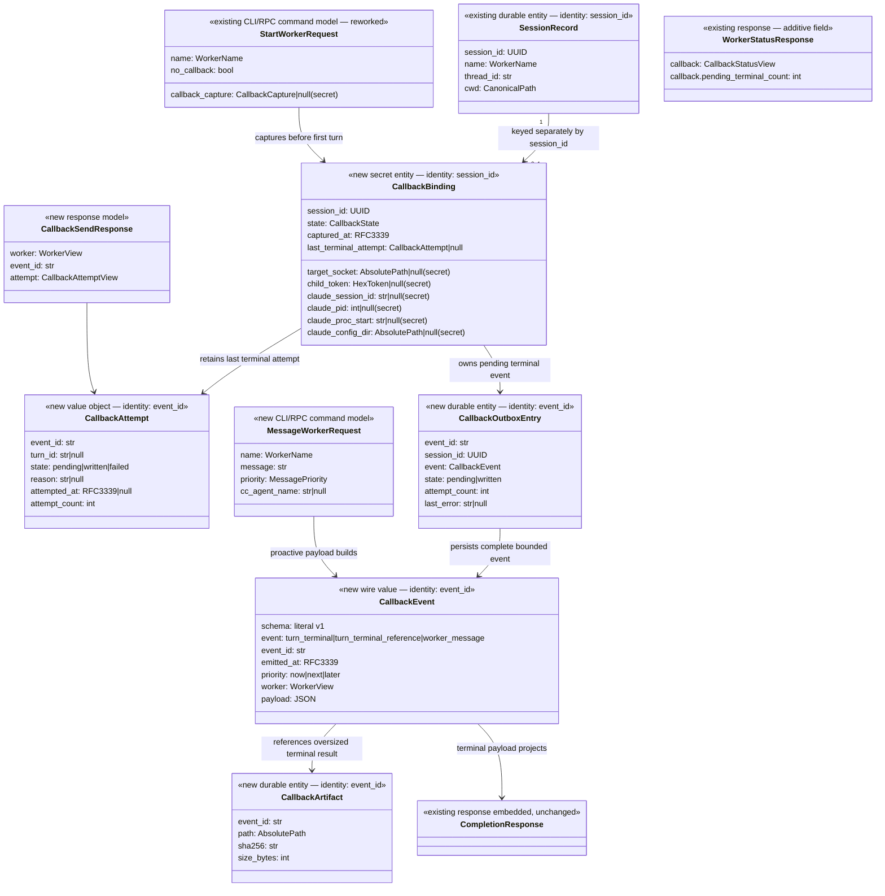

# Codex worker → Claude callbacks — Design (anchor)

**Date:** 2026-08-20 · **Status:** draft
**Mode:** autonomous
**Decision log:** ./2026-08-20-codex-worker-claude-callbacks-decisions.md
**Companions:** ./2026-08-20-codex-worker-claude-callbacks-cli-surface.md;
measured input `/Users/tadas/Projects/ai-ethics/ai-trading-calibration/docs/reference/claude-code-messaging-protocol.md`
**Origin:** brainstorm with Tadas

## 1. Problem & intent   [ANCHOR]

Claude Code can launch named Codex workers and continue them by name, but today Claude
must wait on or poll the worker command to learn that a turn ended. Codex also has no
scoped command for proactively telling its originating Claude room about a question,
risk, or useful partial result while it continues working. The measured Claude Code
2.1.237 peer-inbox protocol proves that a same-machine child can inject a queued prompt
through the originating room's inherited Unix socket and child token, but the current
probe is not integrated with the worker daemon and would expose routing credentials if
handed directly to Codex.

This work makes the worker daemon the sole callback relay. A Claude-launched `start`
captures its return address automatically; every terminal common-worker turn produces a
complete callback without Claude polling; and Codex can send a non-blocking proactive
message through a short named-worker command. Standalone worker use stays independent of
Claude, native Claude Code remains available, and the reverse-engineered protocol never
becomes an MCP or cloud dependency.

Success means a real Claude room starts work, receives proactive and terminal messages
from the correct named worker, can answer later with existing `steer` or `run`, and never
has to disclose or repeat callback metadata in follow-up commands. Results and callback
delivery claims remain honest: a successful socket write is `written`, not `delivered`.

## 2. Requirements   [ANCHOR]

| ID | Requirement | Source | Priority | Acceptance signal |
|----|-------------|--------|----------|-------------------|
| R1 | A worker started inside a valid Claude messaging environment captures a callback automatically; standalone starts remain valid and `--no-callback` suppresses capture. | stated | must | All three launch modes produce explicit enabled/unavailable/disabled state without repeated metadata. |
| R2 | The default callback binding is fixed at worker creation and later `run` calls never replace it from ambient environment. | stated | must | A follow-up from another shell still targets the original Claude room. |
| R3 | Each common-worker turn that becomes `completed`, `failed`, or `interrupted` emits one versioned terminal callback; the complete projected result is inline when it fits and otherwise available through a verified durable reference; observation timeouts do not notify. | stated | must | Claude receives a bounded terminal notification and can recover the entire result for success and non-success without polling. |
| R4 | Codex can send a non-blocking proactive message by required worker name, with `next` default priority and explicit `now|later`; Claude may answer later using existing controls. | stated | must | Codex sends while its turn continues, and Claude can correlate and steer/run the worker. |
| R5 | `cc-agent-name` overrides only one proactive send and never mutates the stored default binding. | stated | must | A redirected message reaches the override target and the terminal callback still reaches the origin. |
| R6 | The daemon alone holds callback credentials; it removes Claude messaging credentials before spawning Codex, and public JSON, logs, prompts, and Codex execution never expose the socket token or peer-token store. | stated + measured security boundary | must | Child-environment inspection, secret scans, and public-response checks find no callback credential or raw target path. |
| R7 | Callback attempts report only provable states, never alter the authoritative Codex turn result, and never silently fall back to another target. | stated + measured one-way transport | must | A send failure leaves the turn terminal status intact and exposes a typed callback state/fault. |
| R8 | Callback binding and a complete bounded outbox entry survive daemon restart while the original Claude room remains live; non-written entries retry with the same event ID under an honest at-least-once write policy, so a crash-window duplicate is possible. | inferred from existing durable-resume goal | must | Restart can resume from persisted payload, never intentionally replays recorded `written`, and exposes stable duplicate identity. |
| R9 | Default sends revalidate the captured Claude session ID, PID, process start, config root, endpoint, owner/type/mode/ancestors before every write; overrides require exactly one live named identity. | measured protocol + existing socket safety | must | PID reuse, adversarial endpoints, and ambiguous names produce typed refusals before a new write. |
| R10 | The daemon enforces Claude's measured 1,048,576 JavaScript UTF-16-code-unit user-line cap on its final envelope, and every public client command emits exactly one JSON object with local usage errors exiting 2 and daemon protocol refusals exiting 1. | existing CLI contract + measured protocol | must | ASCII/non-ASCII boundary and CLI process checks pass at the correct lifecycle boundary. |
| R11 | Existing raw worker methods, native Claude operation, two model tiers, access policy, recovery, and non-destructive daemon stop retain their meaning; no MCP or cloud path is added. | stated + compatibility | must | Existing fast gate and live compatibility ride remain green. |
| R12 | Two stdlib-only working probe scripts demonstrate terminal and proactive event shapes against the live `orchestrator-original` Claude room before production integration is accepted. | stated | must | Correlated pongs exist for both event IDs in tracked or preserved evidence. |

## 3. Use cases   [ANCHOR]

| UC | As a role, I do this and see this | Exercises R# | Realized by §5 area(s) |
|----|------------------------------------|--------------|------------------------|
| UC1 | As Claude, I start a named Codex worker normally and later receive its complete terminal report without polling. | R1, R2, R3, R7 | 5.2, 5.4, 5.5 |
| UC2 | As Codex, I send Claude a question or warning during my turn and continue working; Claude may respond later with `steer` or `run`. | R4, R6, R10 | 5.3, 5.5, 5.6 |
| UC3 | As Claude, I send one proactive message to another named Claude agent without transferring the worker's default completion route. | R2, R5, R9 | 5.3, 5.5 |
| UC4 | As a terminal user outside Claude—or as Claude choosing isolation—I start and run workers normally with callback unavailable or disabled. | R1, R11 | 5.2, 5.7 |
| UC5 | As Claude, I see failed and interrupted worker turns arrive just like successful ones, while a wait timeout produces no false completion. | R3, R7 | 5.4, 5.7 |
| UC6 | As an operator, I restart the daemon and retain the originating route and complete pending event; the same event ID may replay in the crash window, but a recorded write is not intentionally replayed. | R2, R8 | 5.2, 5.4 |
| UC7 | As an implementer, I run both technical probes against `orchestrator-original` and reconstruct each send and pong by event ID. | R9, R10, R12 | 5.3, 5.8 |

## 4. Approach narrative

The measured Claude peer inbox is a one-way local transport, not an RPC service. Directly
giving that socket and token to Codex would turn transport credentials into prompt-visible
capabilities and force automatic and proactive senders to duplicate policy. D11 therefore
places a callback relay inside the existing per-instance worker daemon: the CLI captures
ambient callback material, the daemon persists it separately from public session records,
scrubs it from the Codex child environment (D15), and sends only after binding the
endpoint to the captured Claude process identity. Both callback paths pass through one
hardened sender.

The flow begins with capture (§5.2), proceeds through identity-bound transport and optional
name resolution (§5.3), and splits only at event construction. The common façade creates
terminal events from the already-authoritative completion projection (§5.4); the new
message command creates a proactive event without touching Codex runtime state (§5.5).
Both use the same domain envelope (§5.1), the same typed CLI/RPC contract (§5.6), and the
same honest failure/observability rules (§5.7). Two stdlib probes in the source research
repository prove the raw transport and event shapes independently before the real CLI
checkride composes the whole journey (§5.8).

Large terminal results remain complete through a durable digest-addressed artifact and a
bounded reference event (D17), while the at-least-once write outbox makes its crash-window
duplicate risk explicit (D16). This boundary preserves the current worker architecture: callbacks are additive to the
common named-worker façade, raw app-server methods stay untouched, and a callback failure
cannot rewrite Codex's terminal truth.

## 5. Design

### 5.1 Domain model

The domain model gives capture, events, outbox entries, artifacts, and command models
one vocabulary so the persistence, terminal, proactive, and CLI paths cannot silently
disagree (serves R1–R10; governed by D1–D22; realizes UC1–UC7).

#### 5.1.1 The diagram

`CallbackBinding` lives in a separate owner-only callback store. It is not added to
`SessionRecord`, because raw compatibility surfaces serialize session records and must
never inherit the secret fields accidentally.

#### 5.1.2 Naming & field conventions

- Public CLI flags use kebab case; command models use snake case; JSON uses snake case.
- `worker name` is the required Codex worker identity. `cc_agent_name` is only a one-send
  Claude destination override.
- `written` means the complete frame was handed to the socket. It never means delivered.
- `callback` is the stored route/policy; `message` is the proactive act; `event` is the
  versioned prompt payload.
- Tokens, target sockets, Claude process identity, and resolver roots are secret
  persistence fields, never public annotations.

| Concept | Appears as | Where | Resolution (D#) |
|---|---|---|---|
| Claude destination | room / agent / session name | brainstorm language / Claude registry | D5–D6 — public override is `cc-agent-name`; default is an address-based ambient binding. |
| Worker identity | instance / name / session ID / thread ID | CLI / daemon registry / Codex | D9, D18 — proactive routing uses exact `--instance` plus worker `--name`; the event includes all identities. |
| Send outcome | sent / delivered / written | transport prose / desired UX / measurable fact | D7, D11 — public state is `written`; delivery is never inferred. |
| Completion boundary | idle / done / terminal | operator speech / turn lifecycle | D7 — only `completed|failed|interrupted` terminal transitions emit. |

#### 5.1.3 The delta ledger — what this work adds and removes

| Change | Object.field / invariant | Before | After | Why (D#) |
|---|---|---|---|---|
| ADD | `CallbackBinding` + owner-only `CallbackStore` | no callback persistence | per-session enabled/disabled/unavailable binding, captured Claude identity, and resolver root separate from public records | D1, D2, D6, D15, D21 |
| ADD | `CallbackEvent` v1 | no callback event contract | exact terminal, terminal-reference, and proactive payload kinds share identity/schema/priority | D2, D7, D10, D17, D19 |
| ADD | `CallbackAttempt` + `CallbackOutboxEntry` | no send state | full bounded pending event, same-ID retries, attempt count, and written commit | D7, D11, D16 |
| ADD | `CallbackArtifact` | no callback artifact | full oversized terminal result is atomically persisted and referenced by digest and size | D17 |
| ADD | `StartWorkerRequest.no_callback` and secret `callback_capture` | start ignores Claude messaging env | explicit suppression plus verified ambient capture over owner-only RPC; child env is scrubbed | D8, D15 |
| ADD | `MessageWorkerRequest` / `CallbackSendResponse` | no proactive surface | name-routed non-blocking message with one-send override | D4, D5, D9, D10 |
| ADD | `WorkerStatusResponse.callback` | callback invisible | redacted state, pending terminal count, and last terminal attempt | D7, D16 |
| INVARIANT-ADD | run preserves callback binding | no binding exists | ambient state cannot replace captured route | D1, D6 |
| INVARIANT-ADD | callback failure cannot alter turn result | no callback exists | terminal response remains authoritative | D7 |
| REMOVE | none | — | no existing raw or common surface is removed | D11 |

#### 5.1.4 Invariants

| Invariant | Enforcer |
|---|---|
| One callback binding is keyed by one logical worker session; worker name is resolved before access. | `CallbackStore` typed key API and registry-resolution tests. |
| Secret fields never appear through `to_dict()` public views, repr, faults, logs, or event payloads. | separate secret/public types, `repr=False`, exhaustive serialization and secret-scan tests. |
| `run` cannot mutate a binding and `cc_agent_name` cannot persist. | façade method signatures plus before/after store tests. |
| Automatic events use `next`; proactive priority is exactly `now|next|later`. | closed `MessagePriority` enum and request validation. |
| Terminal event IDs are stable for `(session_id, turn_id, event kind)`. | deterministic event-ID function and identity tests. |
| A persisted `written` entry is never replayed; every non-written retry uses the same complete event and event ID. | callback-store transition validator, crash-window tests, and duplicate-ID assertions. |
| Every non-written terminal event remains independently addressable until written; a later turn cannot overwrite it. | event-ID-keyed outbox, pending-count projection, and multi-turn failure/restart tests. |
| The serialized user frame stays within the measured Claude line cap. | daemon counts JavaScript UTF-16 code units as `len(line.encode("utf-16-le")) / 2`, excluding the newline, before connect. |
| Default sends target only the captured Claude identity; PID reuse or registry drift cannot retarget a worker. | registry identity revalidation on session ID, PID, process start, config root, endpoint, owner, type, mode, and ancestors before every write. |
| Codex app-server children never inherit Claude messaging credentials. | explicit child environment construction removes socket/token variables; child-env regression and secret-scan tests. |
| `disabled` forbids every send including overrides; `unavailable` may use a verified one-message name override. | closed binding-state transition and override-resolution tests. |
| Callback failures cannot change `CompletionResponse.turn.status`. | façade pipeline ordering and regression tests. |

#### 5.1.5 CLI ↔ domain mapping

| CLI command | Command model | Consumes | Produces |
|---|---|---|---|
| `codex-worker start` | `StartWorkerRequest` | worker policy, prompt, `no_callback`, internal ambient capture | existing `CompletionResponse`; durable `CallbackBinding` side effect before turn |
| `codex-worker run` | `RunWorkerRequest` (unchanged) | name, prompt, stored binding | existing `CompletionResponse`; terminal callback attempt |
| `codex-worker message` | `MessageWorkerRequest` | exact instance, worker name, message, priority, optional `cc_agent_name` | `CallbackSendResponse` |
| `codex-worker status` | `WorkerStatusRequest` (unchanged) | worker name | additive callback view on `WorkerStatusResponse` |

### 5.2 Capture and durable binding

Capture establishes the stable zero-config route before the first turn, allowing all
later operations to omit Claude metadata (serves R1, R2, R6, R8; governed by D1, D6,
D8, D15, D21; realizes UC1, UC3, UC4, UC6).

- **Design:** The client process validates the presence and basic shape of
  `CLAUDE_CODE_MESSAGING_SOCKET`, `CLAUDE_CODE_MESSAGING_TOKEN`,
  `CLAUDE_CODE_SESSION_ID`, and `CLAUDE_PID`. It resolves the matching live registry
  record and captures its process-start value plus the canonical `CLAUDE_CONFIG_DIR`
  root. Those secret fields travel only over the owner-only managed RPC socket.
  `--no-callback` writes a `disabled` binding with nullable secret fields; incomplete or
  absent ambient identity writes `unavailable` with nullable secret fields while still
  retaining the canonical, safety-checked Claude config root when one can be resolved at
  start. No later daemon environment is consulted. After the
  broker creates the logical session and before the first turn starts, the façade
  atomically writes the binding to `callbacks.json` using the same owner, mode, fsync,
  replace, and parent-fsync discipline as the session registry. A callback persistence
  failure returns a typed storage fault with worker/thread recovery IDs and does not
  start the first turn. `run` reads but never updates the binding. Before spawning the
  Codex app-server, the daemon constructs a child environment with
  `CLAUDE_CODE_MESSAGING_SOCKET` and `CLAUDE_CODE_MESSAGING_TOKEN` removed; inheritance
  of other non-secret Claude metadata is unchanged.
- **Interface / contract:** public state is enabled/disabled/unavailable plus a redacted
  last attempt. Secrets are neither annotations nor recoverable from public RPC.
- **Depends on:** instance paths, atomic persistence, session creation, CLI env capture.
- **Serves:** R1, R2, R6, R8 · **Governed by:** D1, D6, D8, D15, D21 ·
  **Realizes:** UC1, UC3, UC4, UC6.

### 5.3 Claude transport and override resolution

The transport turns one validated callback event into the exact measured Claude peer
frames without leaking the capability to Codex (serves R5, R6, R9, R10; governed by
D2, D5, D6, D10, D11, D15, D20, D21; realizes UC2, UC3, UC7).

- **Design:** A stdlib-only transport validates absolute socket paths with `lstat`, owner,
  socket type, exact restrictive mode, and safe ancestor rules before connecting. The
  default path first reloads the captured config-root registry and requires the same
  session ID, PID, process-start value, endpoint, and filesystem identity that were
  captured. PID reuse, disappearance, or drift is a typed refusal. A `cc_agent_name`
  override scans only the persisted verified config root inside the daemon, selects
  exactly one live name, derives its peer-token filename with `abspath` rather than
  `realpath`, validates both registry and key files, and refuses zero or multiple
  matches. `disabled` forbids this override; `unavailable` permits it because no default
  capability was retained. The sender writes auth then user NDJSON lines, includes
  `from_mode: bypass`, uses the selected priority, sends no `session_id`, and half-closes.
  Immediately before connect, the daemon serializes the final envelope and rejects a
  proactive event exceeding 1,048,576 JavaScript UTF-16 code units, counted as
  `len(line.encode("utf-16-le")) / 2` excluding the newline.
- **Interface / contract:** transport returns pending/written/failed evidence; it never
  returns delivered. No fallback target exists. An oversized proactive envelope is the
  typed daemon fault `callback_payload_too_large` and therefore exits 1.
- **Depends on:** measured Claude 2.1.237 protocol, callback store, safe-path utilities.
- **Serves:** R5, R6, R9, R10 · **Governed by:** D2, D5, D6, D10, D11, D15, D20,
  D21 · **Realizes:** UC2, UC3, UC7.

### 5.4 Automatic terminal callback

The terminal hook converts the same authoritative result returned by `start` or `run`
into Claude's no-poll notification (serves R3, R7, R8; governed by D1, D2, D7, D10,
D11, D16, D17, D19, D20; realizes UC1, UC5, UC6).

- **Design:** The hook sits after `_start_and_wait` has produced a terminal
  `CompletionResponse`, not on raw `turn/completed` notification arrival. It therefore
  has ordered final messages, structured output, honest metrics, and recovery commands.
  It emits for completed/failed/interrupted only, always at priority `next`. The stable
  event ID and complete bounded event are atomically recorded in the event-ID-keyed
  outbox before any connection. A single daemon-owned terminal dispatcher is the only
  consumer: it wakes for new entries, schedules every recovered/non-written entry with
  bounded backoff, serializes attempts per event ID, and shuts down with the daemon. A
  fully written frame commits `written`; every
  non-written entry remains independently retryable with the same event ID and increments
  `attempt_count`, so a later terminal turn never overwrites an earlier pending event. A
  crash after the OS
  accepted the frame but before the written commit can therefore create a duplicate;
  the receiver can correlate it by event ID. A recorded `written` entry is never
  intentionally replayed. If the inline terminal envelope exceeds the cap, the daemon
  atomically persists the full completion result in the callback artifact directory,
  verifies its SHA-256 digest and byte size, and instead queues a bounded
  `turn_terminal_reference` event containing that path, digest, and size. It does not
  truncate or chunk the report. The callback operation is bounded and its outcome cannot
  replace or mutate the completion result.
- **Interface / contract:** event schema is `codex-worker.claude-callback/v1`, event
  `turn_terminal` when inline or `turn_terminal_reference` when artifact-backed, with
  worker identity and either completion fields or the verified artifact descriptor.
- **Depends on:** completion projection, callback store, transport.
- **Serves:** R3, R7, R8 · **Governed by:** D1, D2, D7, D10, D11, D16, D17, D19,
  D20 · **Realizes:** UC1, UC5, UC6.

### 5.5 Proactive message relay

The proactive relay gives Codex a scoped one-way voice while keeping answers on the
existing worker-control surface (serves R4, R5, R6; governed by D4, D5, D9, D10, D11,
D18, D21; realizes UC2, UC3).

- **Design:** `WorkerFacade.message` resolves the named worker and its stored binding but
  never calls Codex or acquires the app-server request path. This allows a command
  execution inside an active turn to use the threaded daemon without deadlocking the
  original `start/run` request. It validates non-empty text, builds `worker_message`,
  applies the requested priority, and optionally resolves one `cc_agent_name` for that
  send only. The call returns after the bounded transport attempt. No question ID or
  synchronous reply protocol exists. Worker initialization instructions include its
  unique name and instance, the exact
  `codex-worker --instance <instance> message --name <name> ...` syntax, the
  broadcast-like continue-working rule, and the fact that Claude may later steer or run.
  An unavailable default binding may still use a verified one-message override when its
  start-time resolver root exists; an explicitly disabled binding may not send at all.
- **Interface / contract:** one `CallbackSendResponse` or a closed callback fault; no
  stored-route mutation.
- **Depends on:** threaded RPC server, worker resolver, callback store, transport.
- **Serves:** R4, R5, R6 · **Governed by:** D4, D5, D9, D10, D11, D18, D21 ·
  **Realizes:** UC2, UC3.

### 5.6 CLI and RPC surface

The command seam makes callback behavior usable by both Codex and Claude while retaining
the one-object CLI discipline (serves R1, R4, R5, R10, R11; governed by D5, D8–D11,
D13, D18, D20–D22;
realizes UC1–UC4).

- **Design:** `worker/message` is a common RPC method and `message` is a top-level common
  command. It requires worker `--name`, accepts exactly one of `--message` or
  `--message-file`, defaults `--priority next`, and accepts optional
  `--cc-agent-name`. The injected form always includes the worker's exact global
  `--instance`; ordinary callers may still rely on the existing instance-selection
  default or environment. It does not autostart a stopped daemon. `start` gains only
  `--no-callback`; callback capture is internal request data, not another user flag.
  `status` adds the redacted callback view. Strict request/response models and the closed
  façade fault vocabulary cover unavailable, stale-target, target-not-found,
  ambiguous-target, too-large, and send-failed cases. Every locally knowable usage refusal occurs before
  lifecycle work, exits 2, and emits one JSON object. Final envelope size is knowable
  only after daemon serialization, so `callback_payload_too_large` is a protocol refusal
  exiting 1.
- **Interface / contract:** the exhaustive surface is in the CLI companion.
- **Depends on:** command models, RPC dispatch, existing common endpoint selection.
- **Serves:** R1, R4, R5, R10, R11 · **Governed by:** D5, D8, D9, D10, D11, D13,
  D18, D20–D22 · **Realizes:** UC1, UC2, UC3, UC4.

### 5.7 Failure, security, and observability

Honest failure semantics keep callback convenience from weakening worker truth or local
security (serves R6, R7, R8, R9, R11; governed by D2, D7, D11, D15–D17, D20, D21;
realizes UC4–UC6).

- **Design:** Automatic send failure is persisted and projected through status but never
  returned as the turn's error. Proactive failures are typed with worker identities and
  safe recovery commands (`status`, retry the message, or list/verify the named Claude
  target where allowed). Tokens and raw paths are redacted from repr, diagnostics, and
  faults. Malformed non-empty callback state is preserved and refused rather than reset.
  The durable outbox retains every complete non-written terminal event and status exposes
  its count plus the latest terminal attempt view; successful written payloads may be discarded
  after their written marker is durably committed. Artifact retention follows the
  worker's durable state and is never removed by daemon stop. Proactive attempts are
  returned to the caller and need no durable history. Transport logs carry event ID,
  worker name, attempt count, outcome, and redacted reason only. PID reuse, registry
  identity drift, secret leakage, and Unicode boundary violations are distinct tested
  refusals.
- **Interface / contract:** no delivery claim, no wrong-target fallback, no turn-status
  mutation, no state deletion during stop.
- **Depends on:** callback store, typed faults, status projection, non-destructive stop.
- **Serves:** R6, R7, R8, R9, R11 · **Governed by:** D2, D7, D11, D15–D17, D20,
  D21 · **Realizes:** UC4, UC5, UC6.

### 5.8 Probe and checkride evidence

The evidence lane separates transport discovery from product acceptance while proving
both against a real responsive Claude room (serves R9–R12; governed by D11, D12, D14–D20;
realizes UC7 and closes UC1–UC6 at the product gate).

- **Design:** The trading-platform source repository adds two stdlib-only probes that
  import the existing measured sender: one consumes a real completion JSON and emits a
  terminal event; one emits a proactive event. Both support dry-run, print one JSON
  result, and accept `orchestrator-original` as the live target. Its response is captured
  in an append-only JSONL mailbox correlated by event ID. Product integration receives
  deterministic fast coverage plus a real CLI checkride: Claude launches Codex, Codex
  proactively messages and continues, terminal completion arrives without polling, and
  failed/interrupted/no-callback/override journeys are exercised. Deterministic probes
  also cover environment scrubbing, captured-process identity and PID reuse, durable
  same-ID replay after a non-written attempt, artifact-backed oversized terminal
  reports, and ASCII/non-BMP UTF-16 cap boundaries. Existing native Claude and raw
  compatibility are rerun.
- **Interface / contract:** probe evidence is MEASURED and version-labelled; candidate
  transport claims remain labelled until driven.
- **Depends on:** source research repository, `orchestrator-original`, CLI checkride.
- **Serves:** R9, R10, R11, R12 · **Governed by:** D11, D12, D14–D20 · **Realizes:**
  UC7 and validates UC1–UC6.

## 6. Decisions

### D1 — Bind one stable Claude return room at worker creation (status: locked)
- **Decision:** capture once at `start`; later `run` retains the route.
- **Alternatives:** recapture ambient state on every run (convenient but redirectable).
- **Why:** stable worker ownership and short follow-ups.
- **Revisit-when:** cross-room ownership transfer becomes common.

### D2 — Relay both callback paths through the daemon (status: locked)
- **Decision:** daemon owns credentials and sends automatic/proactive events.
- **Alternatives:** direct senders expose credentials; a sidecar adds another lifecycle.
- **Why:** one security, routing, and audit boundary.
- **Revisit-when:** Claude publishes a supported callback API.

### D3 — Allow explicit return-room override (status: superseded-by D5)
- **Decision:** retained historically; D5 narrows the override to one proactive send.
- **Alternatives:** immutable-only route is smaller but cannot redirect a special send.
- **Why:** exceptional review/testing targets exist.
- **Revisit-when:** room ownership becomes centrally brokered.

### D4 — Proactive messages are non-blocking notifications (status: locked)
- **Decision:** send and continue; Claude answers later with steer/run.
- **Alternatives:** synchronous questions require IDs, waits, and recovery.
- **Why:** preserves parallel progress and avoids a second reply protocol.
- **Revisit-when:** a real workflow must await input in the same turn.

### D5 — Override one message with `cc-agent-name` (status: locked)
- **Decision:** override only one proactive send; no persistent setter.
- **Alternatives:** persistent rebind broadens scope and risks later callback diversion.
- **Why:** meets the exception without changing ownership.
- **Revisit-when:** durable transfer is demonstrated.

### D6 — Infer the default directly; reserve `cc-agent-name` for overrides (status: locked)
- **Decision:** ambient socket/token is the default; no Claude name is required.
- **Alternatives:** requiring a room name repeats discoverable metadata.
- **Why:** zero-friction common path and narrower registry access.
- **Revisit-when:** Claude stops exporting the callback capability.

### D7 — Notify every terminal outcome with the complete result (status: locked)
- **Decision:** completed, failed, and interrupted emit; timeout does not.
- **Alternatives:** success-only leaves polling gaps.
- **Why:** no-poll lifecycle must include non-success.
- **Revisit-when:** upstream terminal states change.

### D8 — Ambient-by-default, gracefully absent, explicitly suppressible (status: locked)
- **Decision:** auto-enable under Claude, preserve standalone use, add `--no-callback`.
- **Alternatives:** per-start opt-in adds recurring ceremony.
- **Why:** low friction without a mandatory Claude dependency.
- **Revisit-when:** another harness implements this transport.

### D9 — Proactive sends require worker name (status: locked)
- **Decision:** Codex uses its initialized unique name.
- **Alternatives:** OS identity inference is unreliable under fan-out.
- **Why:** deterministic routing in a shared daemon.
- **Revisit-when:** Codex exposes trustworthy thread-specific command environment.

### D10 — Queue by default with explicit priority (status: locked)
- **Decision:** terminal/ordinary messages use `next`; proactive sends may choose
  `now|next|later`.
- **Alternatives:** always-now interrupts; always-next cannot escalate.
- **Why:** safe normal behavior plus deliberate urgency.
- **Revisit-when:** Claude priority semantics change.

### D11 — Make the daemon the sole callback relay (status: locked)
- **Decision:** choose daemon relay; probes mirror its boundary.
- **Alternatives:** direct scripts duplicate policy; sidecar overbuilds lifecycle.
- **Why:** best composition with existing named-worker RPC.
- **Revisit-when:** several non-worker tools need a shared relay.

### D12 — Use `orchestrator-original` as live target (status: locked)
- **Decision:** correlate probe events with append-only pongs from that named room.
- **Alternatives:** disposable unnamed room weakens stable addressing.
- **Why:** the operator supplied a live always-reply target; an initial pong is measured.
- **Revisit-when:** the room is not live or discoverable.

### D13 — Use explicit message/message-file input (status: locked)
- **Decision:** require exactly one of `--message` or `--message-file`.
- **Alternatives:** positional prose is shorter but diverges from prompt/file handling.
- **Why:** strict local validation and a familiar common-command pattern.
- **Revisit-when:** the entire common CLI adopts positional content.

### D14 — Keep product authority in Superdev and probes at their source (status: locked)
- **Decision:** Superdev owns product spec/code; the trading repository owns measured
  reference, probes, and raw pong evidence.
- **Alternatives:** copying research into Superdev duplicates its source of truth.
- **Why:** one authoritative home per artifact, connected by explicit evidence links.
- **Revisit-when:** the transport becomes a supported reusable Superdev library.

### D15 — Bind process identity and scrub the Codex child environment (status: locked)
- **Decision:** capture Claude session ID, PID, process start, config root, and endpoint;
  remove the messaging socket/token from every Codex app-server child.
- **Alternatives:** endpoint-only binding permits PID/socket reuse; inherited credentials
  let Codex bypass the relay.
- **Why:** the daemon must retain both target integrity and sole possession of the send
  capability.
- **Revisit-when:** Claude publishes a stable, delegated callback capability.

### D16 — Durable at-least-once writes with stable duplicate identity (status: locked)
- **Decision:** persist each automatic terminal event before sending; retry every
  non-written terminal entry under the same event ID; never intentionally replay
  `written`. Proactive calls remain single bounded attempts and an explicit retry is a
  new event.
- **Alternatives:** at-most-once loses crash-window notifications; pretending exact-once
  is impossible without receiver acknowledgement.
- **Why:** no-poll completion values eventual notification more than invisible loss, and
  stable IDs make the unavoidable duplicate window legible.
- **Revisit-when:** Claude acknowledges application event IDs durably.

### D17 — Reference oversized terminal results (status: locked)
- **Decision:** atomically persist the complete result and send a verified bounded
  `turn_terminal_reference` event with path, SHA-256 digest, and byte size.
- **Alternatives:** truncation violates completeness; chunking adds ordering/reassembly.
- **Why:** Claude is notified promptly and can read the exact report locally.
- **Revisit-when:** the supported transport accepts larger structured payloads.

### D18 — Inject exact instance plus worker name (status: locked)
- **Decision:** every proactive command shown to Codex contains global
  `--instance <WorkerView.instance>` and `--name <WorkerView.name>`.
- **Alternatives:** name-only routing can reach another daemon with the same name.
- **Why:** fan-out needs exact daemon and worker identity without ambient guesswork.
- **Revisit-when:** a per-worker command capability replaces global selection.

### D19 — Freeze event names and one-send override scope (status: locked)
- **Decision:** exact events are `turn_terminal`, `turn_terminal_reference`, and
  `worker_message`; only `worker_message` accepts `cc-agent-name`.
- **Alternatives:** aliases and generic `terminal` invite producer/consumer drift.
- **Why:** one closed wire vocabulary is easier to validate and evolve.
- **Revisit-when:** a v2 event schema is deliberately introduced.

### D20 — Daemon owns final UTF-16 envelope sizing (status: locked)
- **Decision:** count final user-line JavaScript UTF-16 code units in the daemon;
  proactive overflow is `callback_payload_too_large` exit 1 and terminal overflow uses
  D17.
- **Alternatives:** client estimates cannot see daemon-added envelope fields; byte or
  Python-character counts diverge for Unicode.
- **Why:** only the daemon has the exact serialized wire line.
- **Revisit-when:** Claude documents a different framing limit.

### D21 — Persist resolver root; disabled is absolute (status: locked)
- **Decision:** store the verified start-time Claude config root whenever resolvable and
  never substitute later daemon ambient state. `disabled` forbids default and override
  sends; `unavailable` permits a verified named one-message override only when that
  stored root exists.
- **Alternatives:** resolving from later ambient state redirects lookup; allowing an
  override after explicit disable violates operator intent.
- **Why:** stable resolution and a precise distinction between absent capability and
  explicit suppression.
- **Revisit-when:** callback policy gains a separate runtime enable operation.

### D22 — Reserve a closed callback fault-code block (status: locked)
- **Decision:** add `-32031` through `-32037` in order for callback unavailable, stale
  target, target not found, target ambiguous, target unsafe, send failed, and payload too
  large. Callback persistence failures continue to use existing `-32011 registry_error`.
- **Alternatives:** map distinct recovery states onto generic `codex_failure`, or leave
  numbers to implementation and risk CLI/API drift.
- **Why:** each refusal is actionable before implementation and the current façade uses
  a closed kind/code vocabulary.
- **Revisit-when:** the JSON-RPC public error registry is versioned.

## 7. Assumptions & open questions

| ID | Assumption / question | Affects | Status |
|----|----------------------|---------|--------|
| A1 | Claude Code's measured 2.1.237 local peer protocol may change because it is not a published compatibility contract. | R1–R3, R5–R10, §5.3–5.8 | unratified; version-labelled probe and typed unavailable behavior prevent silent reliance |
| A2 | The existing `ThreadingUnixServer` can service `worker/message` while a common start/run request waits, provided the message path never calls the Codex adapter. | R4, UC2, §5.5 | ratified by source at `rpc.py:109`; still requires a live concurrency receipt |
| A3 | The child token remains valid only while the captured Claude registry identity (session ID, PID, process start, config root, and endpoint) still matches; a dead/restarted/reused process makes the stored route unavailable rather than transferable. | R2, R8, §5.2–5.4 | ratified by measured registry fields plus D15; every send revalidates identity |
| A4 | `orchestrator-original` remains live for the bounded probe/checkride window. | R12, UC7, §5.8 | ratified by operator and measured seq=2 pong; replace target if liveness check fails |

No must requirement silently depends on A1 staying stable: the transport is probed,
version-labelled, and allowed to become explicitly unavailable without breaking worker
execution.

## 8. Not doing

- Synchronous Codex question/reply waits — Codex sends and continues; Claude uses
  existing `steer` or `run` later.
- Persistent ownership transfer — `cc-agent-name` affects one message only.
- Multi-room broadcast — one callback event has one explicit destination.
- MCP, cloud bridge, PTY injection, or remote callbacks — this is same-machine Claude
  peer-inbox integration only.
- Delivery claims the wire cannot prove — `written` is the strongest normal result.
- Arbitrary Codex access to Claude session registries, peer-token stores, sockets, or
  callback credentials — only the daemon relay gets those capabilities.
- A production-grade generic messaging CLI in the trading repository — its two scripts
  are technical probes; production surface lives in Superdev.
- Automatic retry of recorded `written` events — non-written events retry with the same
  event ID under the explicit at-least-once policy.
- Raw session/turn callbacks — the additive feature belongs to named common workers.

## 9. Acceptance — hints & receipts   [ANCHOR: the hints]

| # | Acceptance hint (operator terms) | Proves | Lane | Receipt (filled at gate) |
|---|----------------------------------|--------|------|--------------------------|
| AH1 | Claude starts a named worker with no callback boilerplate and receives the complete successful report without polling, inline or through a verified artifact reference. | UC1 / R1–R3 | live checkride | |
| AH2 | A follow-up launched from different ambient Claude metadata still reports to the worker's original room. | UC1, UC6 / R2, R8 | fast + live | |
| AH3 | Codex proactively tells Claude something during an active turn, continues working, and accepts a later steer/run response. | UC2 / R4, R6 | live checkride | |
| AH4 | One proactive message reaches an explicitly named alternate Claude agent while the eventual terminal callback still reaches the origin. | UC3 / R2, R5, R9 | live checkride | |
| AH5 | Completed, failed, and interrupted turns notify; a wait timeout does not masquerade as completion. | UC5 / R3, R7 | fast + live | |
| AH6 | Standalone and explicitly callback-disabled workers retain the ordinary worker experience with honest callback state. | UC4 / R1, R11 | fast + live | |
| AH7 | A daemon restart retains the complete non-written callback, retries it with the same event ID, exposes the possible crash-window duplicate, and never intentionally replays a recorded `written` event. | UC6 / R8 | fast process scenario | |
| AH8 | Callback transport scrubs Codex child credentials and rejects unsafe, PID-reused, identity-drifted, Unicode-oversized, missing, and ambiguous targets without leaking secrets or changing turn truth. | UC3–UC6 / R6, R7, R9, R10 | fast + refusal checkride | |
| AH9 | Both stdlib probes send versioned events to `orchestrator-original`, whose append-only pongs correlate by event ID. | UC7 / R12 | live probe | |
| AH10 | Existing native Claude, raw worker methods, model/access policy, recovery, and non-destructive stop still work without MCP or cloud messaging. | UC1–UC6 / R11 | fast + live compatibility | |
| AH11 | Every callback client outcome is exactly one JSON object and distinguishes written from delivered. | UC2, UC3, UC7 / R7, R10 | fast + live | |

## 10. Drift protocol

This protocol governs the design region (§4–§8). Anchor changes (§1–§3 and §9 hints)
follow autonomous soften-but-own: an unmet requirement or hint becomes an owned backlog
item naming its R#/UC#/AH# before the branch closes; it is never silently edited away.

When build reality contradicts a §5 area:

1. Find the governing D# and test its revisit trigger.
2. Append the build fork to the decision log with a new D#; never rewrite history.
3. Amend the affected §5 area and mark superseded decisions explicitly.
4. If the change reaches the anchor, file the owned backlog item before proceeding.
