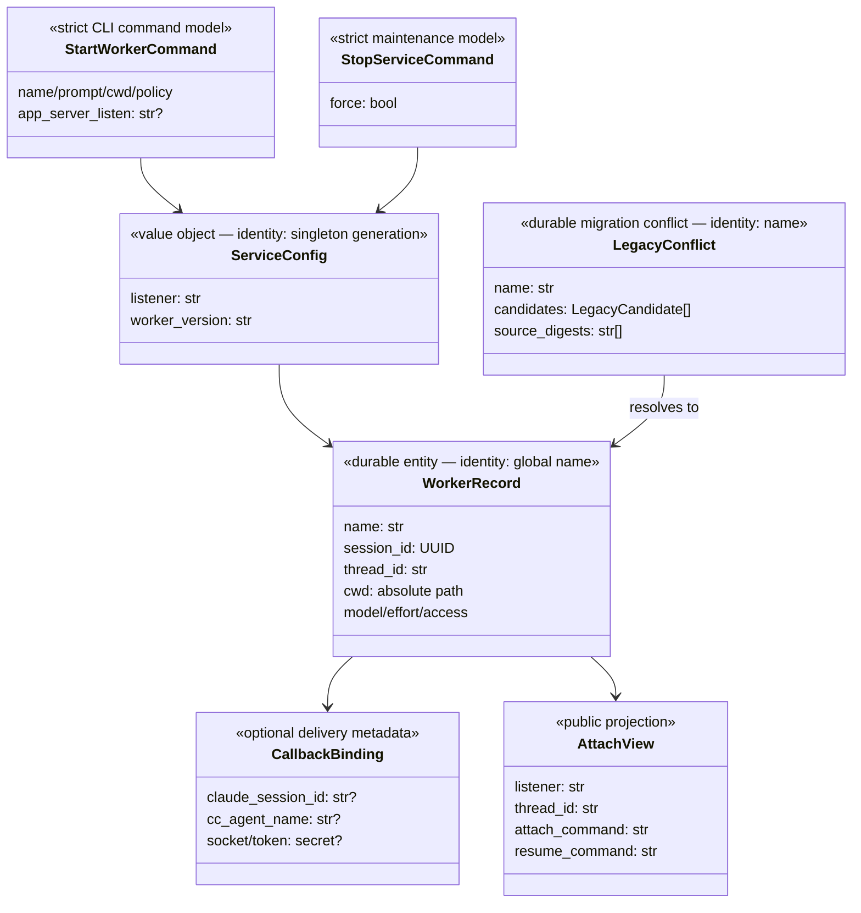

# Codex worker shared app-server — Design (anchor)

**Date:** 2026-08-28 · **Status:** approved (operator delegated autonomous build; independent spec review approved)
**Mode:** human-in-loop through D11, then autonomous by explicit operator delegation
**Decision log:** ./2026-08-28-codex-worker-shared-app-server-decisions.md
**Companions:** ./2026-08-28-codex-worker-shared-app-server-cli-surface.md · ./2026-08-28-codex-worker-shared-app-server-angle-01-service-ownership.md · ./2026-08-28-codex-worker-shared-app-server-angle-02-shared-control.md · ./2026-08-28-codex-worker-shared-app-server-angle-03-identity-and-cli.md · ./2026-08-28-codex-worker-shared-app-server-angle-04-lifecycle-and-migration.md · ./2026-08-28-codex-worker-global-install-design.md
**Origin:** live operator brainstorm followed by explicitly delegated autonomous completion

## 1. Problem & intent   [ANCHOR]

Today each managed `codex-worker` instance starts a private `codex app-server` and talks
to it through stdin/stdout. That makes the worker durable from Claude Code's point of
view, but the process has no address a human Codex terminal can attach to. Instance
selection also defaults from `CLAUDE_CODE_SESSION_ID`, creating physically separate
daemons whose owners cannot know whether another session is using them. A session-local
cleanup can therefore disconnect work outside its context.

The operator wants one machine-local internal service that is normally always available.
Claude Code continues using short `codex-worker` commands; WebSocket mechanics stay out of
ordinary prompts. The service owns one Codex app-server and publishes its maintenance-aware
gateway at the deterministic default `ws://127.0.0.1:4500`. A human can connect the ordinary Codex TUI, resume the exact
reported Codex thread, observe the same event stream, and exercise full follow-up,
steer, and interrupt control. Multiple Claude sessions and the human TUI are independent
clients; worker names—not Claude session IDs—are the global public identity.

The design deliberately remains internal-tool sized. It uses Codex's experimental
WebSocket transport directly, preserves explicit public listener overrides, and does not
build rolling deployment, a lease protocol, or a second security product. It does make
service-wide interruption explicit and guarded, preserve every durable identity during
migration/restart, and refuse rather than guess when a port, version, control turn, or
legacy name is ambiguous.

## 2. Requirements   [ANCHOR]

| ID | Requirement | Source | Priority | Acceptance signal |
|---|---|---|---|---|
| R1 | One machine-local `codex-worker` service and one Codex app-server must outlive individual Claude/TUI clients and auto-start when absent. | operator | must | Separate clients exit; later commands reuse the same service and durable workers. |
| R2 | The default human attach listener must be exactly `ws://127.0.0.1:4500`; an explicit connectable `ws://HOST:PORT` creation/maintenance override is preserved exactly; port zero and wildcard/unspecified hosts are invalid; occupied default refuses without fallback or process killing. | operator + owned D17 safety refinement | must | Status and refusal show the exact usable address and no alternate bind occurs. |
| R3 | A remote Codex TUI and the worker connection must have full shared control of the same thread, with app-server responses/events authoritative. | operator + measured probe | must | Client B resumes A's thread, starts/steers/interrupts work, and both observe authoritative completion. |
| R4 | Worker `name` must be globally unique and ambient Claude session identity must not filter lookup or select infrastructure. | operator | must | Two callers resolve the same name; duplicate creation refuses globally. |
| R5 | Every creation, continuation, status, and partial failure must preserve known wrapper `session_id`, Codex `thread_id`, listener, and runnable attach/resume routes. | operator | must | Human receives a working `codex --remote … resume <thread_id>` route. |
| R6 | Claude room/session/socket/token data must remain optional callback delivery metadata only and secrets must never enter public output/logs. | operator | must | Cross-session worker lookup is unchanged while callbacks still route to the captured room. |
| R7 | Normal skill/task completion must never stop shared infrastructure. Maintenance stop/restart must refuse active turns unless supervised `--force` is explicit, and must preserve durable state. | operator | must | Skill has no routine stop; active-work refusal and forced impact report are visible. |
| R8 | Same-version clients reuse the service; version mismatch automatically restarts only at global zero-active-turn state and otherwise refuses busy. | operator | must | Idle upgrade preserves mappings; active upgrade does not terminate work. |
| R9 | Legacy per-instance registries must migrate losslessly: unique records import, identical records deduplicate, divergent duplicate names remain explicit conflicts, and source directories are not deleted. | discovered | must | Migration ledger/digests and conflict recovery reproduce every known identity. |
| R10 | Existing common worker functions—start/run/message/status/messages/history/control/goal/limits/model/session/turn—and Python 3.9 UV installation must remain available on the global service. | existing contract | must | Existing deterministic suite plus installed live journey pass after surface migration. |
| R11 | Explicit public listener overrides may use any connectable `ws://HOST:PORT` accepted by the service gateway; non-loopback exposure/auth state must be honestly projected and never inferred safe. | operator, refined by D17 to preserve R7/R8 | should | Requested public address is preserved; status labels exposure/auth as measured/unknown. |
| R12 | At least five named workers plus an attached second WebSocket client must operate concurrently without crossed identity, notifications, callback routes, or files. | existing concurrency bar + operator | must | Live ride proves five simultaneous names and one shared human-style client. |

## 3. Use cases   [ANCHOR]

| UC | As a user, I do this and see this | Exercises | Realized by |
|---|---|---|---|
| UC1 | Claude runs one short `start`; I receive the worker/session/thread IDs and a copyable remote attach/resume command. | R1, R2, R4, R5 | §5.1, §5.3, §5.5 |
| UC2 | I attach the Codex TUI, resume the reported thread, watch the same work, then issue a follow-up, steer, or interrupt while the worker reconciles the result. | R3, R5 | §5.2, §5.4 |
| UC3 | Several unrelated Claude sessions create distinct global names and work concurrently without passing Claude session IDs or transport settings. | R1, R4, R12 | §5.1, §5.3, §5.4 |
| UC4 | Claude and my TUI exit; later either interface reconnects to the fixed endpoint and resumes the same durable thread. | R1, R2, R5, R7 | §5.1, §5.5 |
| UC5 | Port 4500 is occupied by an unknown peer; startup refuses with the address and recovery instead of killing it or selecting another port. | R2 | §5.1, §5.6 |
| UC6 | The installed tool changes while work exists; active work is never interrupted, while an idle service restarts and preserves every mapping. | R7, R8 | §5.1, §5.6 |
| UC7 | The first global start finds old instance registries; unique workers appear globally and duplicate names produce lossless, actionable conflicts. | R4, R9 | §5.3, §5.6 |
| UC8 | Under supervision I stop or force-restart the shared service and see the complete impact; ordinary skill cleanup never suggests it. | R7 | §5.1, §5.5, §5.6 |
| UC9 | A globally named worker sends a proactive/terminal message to its captured Claude room, while a human TUI controls it independently. | R6 | §5.3, §5.4 |
| UC10 | I install the UV tool and use every existing worker/raw proxy function against the single service from unrelated directories. | R10, R11 | §5.2, §5.5, §5.7 |

## 4. Approach narrative

The design moves the ownership boundary upward. Instead of deriving a physical daemon
from each Claude session, one global broker owns one global Codex app-server (D6, D11).
The broker binds its existing protected Unix RPC socket for `codex-worker` commands and
starts Codex on an owner-only private Unix-WebSocket socket. A thin service-owned gateway
publishes the chosen human attach listener—port 4500 by default—and forwards each TUI
connection one-to-one to that same app-server (D3, D5, D17). The broker uses another
initialized private connection (D12).

Inside the service, worker names remain the ergonomic selector, now globally unique
(D7). Each record carries the wrapper session ID, Codex thread ID, immutable policy,
callback binding, and no infrastructure namespace. A remote TUI resumes the Codex
thread ID directly. Because app-server subscriptions are per connection, both worker
and TUI receive events after resume; app-server state settles conflicting actions (D4).

Lifecycle is shared-service lifecycle, not task cleanup. Common commands ensure the
service; none stops it. A gateway/broker maintenance gate first blocks every new mutation,
then pages the app-server's all-source thread inventory; this closes the external-client
race before any ordinary stop or idle upgrade (D17). Version replacement is automatic only
when globally idle (D10), and global stop/force is guarded maintenance (D8). A migration ledger imports old
per-instance records without deleting sources or guessing through name conflicts (D14).
These pieces compose into a stable internal service whose transport is invisible to
Claude Code but deliberately visible to the human through attach/resume metadata.

## 5. Design

### 5.1 Global service topology and lifecycle

This area establishes the one physical authority that lets every later identity and
control operation compose (R1, R2, R7, R8; D3, D6, D8, D10, D17; UC1, UC3–UC6, UC8).
**Status:** `FLEXIBLE (D3/D6/D8/D10 locked; D17 autonomous provisional)`

```text
codex-worker CLI ── protected Unix RPC ── GlobalWorkerService
                                           ├── GlobalRegistry
                                           ├── RuntimeStore
                                           ├── CallbackDispatcher
                                           ├── public WS gateway :4500 ── TUI
                                           └── codex app-server --listen unix://PRIVATE
```

- Global durable root: platform state home `/superdev/codex-worker/service/`.
- Global runtime root: owner-only temp path with one RPC socket/lock and service metadata.
- Global durable paths include the registry, callback store, callback artifact directory,
  service config and migration ledger; none is derived from Claude session identity.
- Any managed client command probes exact service identity/version, then reuses or starts.
- Readiness requires verified child PID, private listener health, initialized worker WebSocket,
  public gateway health, global RPC socket, matching version, and durable registry availability.
- Listener configuration is fixed for one service generation. A conflicting requested
  override returns `service_config_conflict`; it never mutates a live service.
- Default bind collision returns `address_in_use`; the existing peer is not
  signalled or trusted merely because it accepts connections.
- No completion/callback/finally path stops the service. Idle version replacement is the
  sole automatic restart path. Maintenance acquires the service mutation gate, drains forwarded
  mutations, pages authoritative all-source `thread/list`, and fails closed on inventory error.

**Interface / contract:** `ServiceStatusView` includes worker/app-server PIDs, versions,
listener, exposure/auth projection, worker/session/active-turn counts, migration state,
and durable paths.
**Depends on:** §5.2 transport, §5.3 registry.
**Serves:** R1, R2, R7, R8 · **Governed by:** D3, D6, D8, D9, D10, D17 · **Realizes:** UC1, UC3–UC6, UC8.

### 5.2 WebSocket app-server transport

This area makes the broker and TUI peers on the same Codex process rather than merely
similar clients of separate processes (R3, R10, R11; D1, D4, D12, D13, D16, D17; UC2, UC10).
**Status:** `FLEXIBLE (D12–D13/D16–D17 autonomous provisional inside locked D1/D4 boundary)`

It is not:

- a WebSocket wrapper around the worker's Unix RPC protocol;
- a second app-server exposed only for display;
- notification broadcast without per-connection subscription.

The broker adapter retains the current request-ID/pending-queue/thread-safe call contract but
encodes one JSON-RPC object per WebSocket text frame. It initializes once with
`clientInfo.name = "superdev_codex_worker"`, handles server approval/input requests,
delivers notifications to `RuntimeStore`, bounds frames/queues, and closes all waiters
with a typed transport fault. The maintained synchronous `websockets` client is isolated
inside this module and installed only in the UV tool environment. The public gateway accepts
`ws://HOST:PORT`, maps each frontend connection to one private Unix-WebSocket connection, and
forwards Codex responses/events unchanged. It parses request metadata only to enforce the
maintenance gate. Upstream overload retries are bounded to idempotent readiness/observation
calls; mutation is never replayed.

Initialization is not replayed on one connection. If its request receives overload, the adapter
closes that transport and performs a bounded reconnect; the new connection receives exactly one
fresh initialize/initialized handshake. Later idempotent reads may retry in place with bounded
backoff and jitter. A mutating call surfaces busy immediately.

The app-server child stdout/stderr are diagnostics, not protocol. Private and public listener
readiness are checked independently; no untrusted stderr content enters public output. The
gateway is the public bind authority. Status labels loopback versus non-loopback and configured
auth when it can be measured; unknown is represented as unknown.

**Interface / contract:** `CodexConnection.call(method, params, timeout)`, server-request
handler, notification callback, `shutdown`; transport errors keep method/context without
secrets.
**Depends on:** the installed Codex version's generated app-server schema (currently 0.150.1);
`websockets`; §5.1 ownership.
**Serves:** R3, R10, R11 · **Governed by:** D1, D4, D9, D12, D13, D16, D17 · **Realizes:** UC2, UC10.

### 5.3 Domain model, global identity, and migration

This area turns the global topology into one truthful name/identity model while carrying
legacy state forward losslessly (R4–R6, R9; D7, D11, D14; UC1, UC3, UC7, UC9).
**Status:** `FLEXIBLE (D7/D11 locked; D14 autonomous provisional)`

#### 5.3.1 Diagram



#### 5.3.2 Naming and discrepancy table

| Concept | Before | After | Resolution |
|---|---|---|---|
| Physical selector | `instance`, sourced from flag/env/Claude session | one global service; no public selector | D6, D11 |
| Worker identity | name unique inside instance | name unique globally | D7 |
| Codex resumable ID | `thread_id`, sometimes described casually as session | always `thread_id`; wrapper UUID remains `session_id` | D2 |
| Claude session | infrastructure instance source plus callback metadata | callback metadata only | D7 |
| Human attach listener | none | durable `public_gateway_listener` service config; Codex child stays private Unix-WebSocket | D1, D5, D17 |

#### 5.3.3 Delta ledger

| Change | Before | After | Why |
|---|---|---|---|
| REMOVE `InstanceIdentity` from public commands | physical daemon keyed by instance | singleton `ServiceIdentity` | D11 |
| ADD `ServiceConfig.listener` | no app-server address | fixed/persisted listener | D3, D5 |
| RETYPE registry name uniqueness | per registry | global registry | D7 |
| ADD `LegacyConflict`/migration ledger | no cross-instance merge | lossless idempotent import | D14 |
| ADD `AttachView` | recovery split across fields/actions | exact attach/resume projection | D2 |
| RECLASSIFY Claude capture | instance selection + callback | callback only | D7 |

#### 5.3.4 Invariants and enforcers

- One global name maps to at most one imported `WorkerRecord`; registry validator and
  exhaustive conflict tests enforce it.
- `session_id` is a UUID and `thread_id` is the Codex resumable identifier; strict models
  and projection tests prevent swapping.
- Callback secrets serialize only in owner-only callback storage and are redacted from
  every view/log/transcript; serializer allowlist tests enforce it.
- Migration is idempotent by source path+digest; atomic file replace plus directory fsync
  enforce crash durability.
- Divergent duplicates cannot be looked up until explicit resolution; no timestamp path
  exists in the resolver.
- Legacy source files are read-only inputs and never deletion targets.
- Callback migration follows D20: prevalidate the complete canonical merge, then publish
  verified artifacts, registry, callback store and completion ledger in that order. The
  service cannot become ready until the ledger is complete; restart repairs an incomplete
  prefix idempotently from untouched sources. Binding/outbox key conflicts quarantine the
  associated worker candidate rather than choosing by time, and legacy absolute artifact
  references are verified then republished beneath the global artifact root.

#### 5.3.5 CLI ↔ domain mapping

| CLI command | Command model | Consumes/produces |
|---|---|---|
| `start` | `StartWorkerCommand` | `ServiceConfig`, `WorkerRecord`, `AttachView` |
| `run` | `RunWorkerCommand` | global name → `WorkerRecord`, `AttachView` |
| `status` | `StatusWorkerCommand` | global name → worker/runtime/attach view |
| `daemon start/status` | `StartServiceCommand` / `StatusServiceCommand` | `ServiceConfig`, `ServiceStatusView` |
| `daemon stop/restart` | `StopServiceCommand` / `RestartServiceCommand` | global activity inventory, impact view |
| `migration status/resolve` | `MigrationStatusCommand` / `ResolveLegacyConflictCommand` | migration ledger/conflicts/global record |
| callback commands | existing strict models | `WorkerRecord.callback` only; never identity |

**Depends on:** registry/callback persistence; §5.1 paths.
**Serves:** R4, R5, R6, R9 · **Governed by:** D7, D11, D14, D18, D20 · **Realizes:** UC1, UC3, UC7, UC9.

### 5.4 Shared control and authoritative reconciliation

This area makes human/Claude co-control legible instead of layering an invented lease
over Codex (R3, R12; D4; UC2, UC3, UC9).
**Status:** `FLEXIBLE (D4 locked; D17 autonomous provisional)`

Worker-created/resumed threads subscribe the broker connection. TUI `resume` subscribes
its connection. Notifications are processed independently but describe the same
authoritative thread/turn. Worker control captures the intended turn ID and maps exact
app-server active/not-active responses; it never applies a TUI action twice or rolls it
back. A TUI-started turn is reflected into `RuntimeStore` and becomes visible through
worker `status/messages/history`; a later worker follow-up obeys the resulting state.

Every worker mutation enters the internal side of `ServiceMaintenanceGate`; every TUI request
enters its gateway side. Draining blocks new and unknown mutating requests, lets client
responses to server-initiated approval/input plus interrupt/read operations pass, waits
already-forwarded mutations to settle, then enumerates every `thread/list` page with
`sourceKinds: []`. This includes TUI-created threads without worker records and is the only
maintenance activity authority.

Approval policy remains attached to the worker record. The broker answers server
approval requests it receives under that policy. The TUI may answer requests routed to
its own connection. No client is declared owner merely by subscribing.

**Interface / contract:** every control result identifies requested/available turn IDs;
race refusals are typed and actionable.
**Depends on:** §5.2 subscriptions; RuntimeStore.
**Serves:** R3, R7, R8, R12 · **Governed by:** D4, D17 · **Realizes:** UC2, UC3, UC6, UC8, UC9.

### 5.5 CLI projection and ordinary experience

This area keeps WebSocket/service mechanics below the short named-worker surface while
giving the human everything needed to attach (R2, R5, R10; D2, D5, D7, D11; UC1, UC4,
UC8, UC10).
**Status:** `FLEXIBLE (D2/D5/D7/D11 locked; D15 autonomous provisional)`

`start` and `daemon start` accept the only routine transport override,
`--app-server-listen`; omission means the fixed default. Later common commands accept no
listener or instance argument. Existing `--socket` remains an explicit raw/testing
endpoint and bypasses managed ensure behavior exactly as today. `--instance` and
`CODEX_WORKER_INSTANCE` are removed.

Every worker-bearing success/fault includes known IDs. When a thread is known and the
shared listener is ready, projection adds shell-safe `attach_command` and
`resume_command`. The ordinary skill tells Claude to report those fields to the human;
it does not teach Claude WebSocket lifecycle. `daemon stop/restart` help and docs carry
the supervised global-impact warning.

**Depends on:** CLI companion; §5.1, §5.3.
**Serves:** R2, R5, R10 · **Governed by:** D2, D5, D7, D11, D15 · **Realizes:** UC1, UC4, UC8, UC10.

### 5.6 Faults, recovery, and maintenance safety

This area converts global blast radius and migration ambiguity into refusals rather than
surprise actions (R2, R7–R9; D3, D8, D10, D14, D17; UC5–UC8).
**Status:** `FLEXIBLE (D3/D8/D10 locked; D14/D17 autonomous provisional)`

New closed faults:

| Code | Kind | Meaning |
|---|---|---|
| -32039 | `address_in_use` | requested listener cannot be safely bound/owned |
| -32040 | `service_busy` | active turns block stop/restart/version replacement |
| -32041 | `legacy_name_conflict` | divergent legacy candidates block this global name |
| -32042 | `service_config_conflict` | caller requested listener differs from live generation |

Every fault reports measured listener/version/activity and known identities without
tokens. Recovery actions never include force automatically. Maintenance impact includes
active and idle worker names/counts plus durable-state promise. Forced stop/restart is
accepted only from the explicit command model and is never emitted by a callback, skill,
or retry action.

Active threads without a `WorkerRecord` remain first-class impact rows with `worker: null`,
their Codex `thread_id`, and `origin: "unmapped_tui"`; lack of wrapper metadata never removes
them from the count or force report.

The active inventory is app-server-wide, not registry-wide:

```text
page thread/list(cursor, sourceKinds=[])
  collect every thread where status.type == "active"
  inventory/page/protocol error -> refuse maintenance
```

**Depends on:** §5.1 inventory; §5.3 conflicts.
**Serves:** R2, R7, R8, R9 · **Governed by:** D3, D8, D10, D14, D17 · **Realizes:** UC5–UC8.

### 5.7 Packaging, compatibility, and verification

This area keeps the architecture usable as the globally installed internal tool rather
than only from source (R10–R12; D10, D12, D13, D16, D17; UC2, UC3, UC6, UC10).
**Status:** `FLEXIBLE (D10 locked; D12–D13/D16–D17 autonomous provisional)`

The PEP 621 package adds a bounded `websockets` dependency compatible with Python 3.9.
Source imports remain lazy so deterministic tests can inject a fake connection without
ambient packages. The archive/sync/version authorities include the dependency metadata.

Fast tests cover strict models, global paths, migration, exact bind/refusal, request
correlation, notification fan-out, active guards, projection, and secret absence. Slow
lanes run separately: installed Python 3.9 UV package; two real WebSocket clients on one
thread; exactly five simultaneous named workers; listener collision; idle upgrade and
active refusal; legacy migration; real Claude common-command caller; and CLI checkride.

**Depends on:** all prior areas.
**Serves:** R10, R11, R12 · **Governed by:** D10, D12, D13, D16, D17, D18, D19 · **Realizes:** UC2, UC3, UC6, UC10.

## 6. Decisions

- **D1:** same app-server is exposed through WebSocket; revisit on a supported shared local-daemon API.
- **D2:** worker surface owns/hides transport and always returns identities/routes; revisit for external ownership.
- **D3:** fixed port 4500 with typed collision, never fallback; revisit for automatic multi-endpoint orchestration.
- **D4:** full shared control, app-server authoritative, no lease; revisit on measured missed events/single-writer rule.
- **D5 (refined by D17):** shared public WebSocket is default with creation override; the
  gateway, not the Codex child, now owns that public listener.
- **D6:** one long-lived machine service; revisit on measured resource isolation need.
- **D7:** global worker names; Claude identity is callback-only; revisit if global names become unmanageable.
- **D8:** guarded supervised maintenance; revisit on transactional per-client detachment.
- **D9 (superseded in part by D17):** operator selected unrestricted Codex listener
  pass-through; the public listener is now gateway-owned to make maintenance safe.
- **D10:** idle-only automatic version restart; revisit for distribution/zero-disconnect upgrades.
- **D11:** remove public instances and migrate state; revisit if process isolation becomes necessary.
- **D12 (provisional, refined by D17):** broker remains a direct private WebSocket client;
  public TUI connections pass through the maintenance-aware gateway.
- **D13 (provisional):** maintained isolated dependency; revisit on a standard/proxy client.
- **D14 (provisional):** non-conflicts import, conflicts quarantine; revisit after supervised legacy retirement.
- **D15 (provisional):** the public CLI removes instance routing, adds attach projection, guarded maintenance,
  and explicit migration resolution; revisit only when the topology itself changes.
- **D16 (provisional, listener portion superseded by D17):** overload never replays mutation;
  the public listener is now specifically gateway-owned `ws://HOST:PORT`.
- **D17 (provisional):** a maintenance-aware public WebSocket gateway fronts the private
  app-server and closes the TUI turn race; revisit on atomic upstream drain support.
- **D18 (provisional):** evolve the existing strict dataclass seams in place while splitting
  new service responsibilities into focused modules; revisit on an independent Pydantic migration.
- **D19 (provisional):** reconcile the measured split 8.0.0 baseline, then advance every declared
  plugin/tool authority together to 8.1.0; revisit if main's highest version changes before release.
- **D20 (provisional):** migrate callback bindings/outbox/artifacts as an idempotent pre-readiness
  transaction and leave every legacy source untouched; revisit on a unified transactional store.

Full alternatives, sacrifices, evidence, and extension laws remain in the decision log.

## 7. Assumptions & open questions

| ID | Assumption / question | Affects | Status |
|---|---|---|---|
| A1 | The installed Codex release keeps one app-server process capable of multiple initialized clients resuming one thread. | R3, R12, §5.2/5.4 | ratified by official per-connection lifecycle plus exploratory two-client probe; current 0.150.1 remains a mandatory tracked live receipt |
| A2 | An internal fixed-port service may rely on the current user's process/session environment and existing Codex authentication. | R1, R10 | ratified by operator internal-tool scope; live package lane |
| A3 | `websockets` synchronous client/server remains Python 3.9 compatible in the pinned range. | R10, §5.2/5.7, D13/D17 | ratified by isolated UV Python 3.9.6 import of websockets 15.0.1 sync client/server on 2026-08-28; package lane repeats it |
| A4 | Global active-turn inventory is sufficient for internal idle upgrade safety even if an idle TUI remains connected. | R8 | ratified by operator; idle disconnect explicitly accepted |

## 7b. Test disposition

| Area touched | Disposition | Notes |
|---|---|---|
| Existing app-server/runtime/broker tests | fix-in-place | Preserve behavioral harvest; replace stdio transport fixtures only where the interface intentionally changes. |
| Existing instance/CLI tests | fix-in-place | Rework managed-instance expectations into singleton service laws; retain raw `--socket` coverage. |
| Existing skill integration tests | fix-in-place | Replace stop/per-session-instance prose with always-on/global-name behavior. |
| New WebSocket/migration paths | keep + add focused tests | Fast fake-connection tests plus separate live lanes; no archive needed. |

The operator delegated remaining decisions and build; fix-in-place is the least lossy
disposition because the existing suite carries extensive security and durability
regressions that still govern the new topology.

## 8. Not doing

- Production support for Codex's experimental WebSocket transport—internal-tool scope only.
- Rolling/zero-disconnect upgrades or mixed client/service protocol versions.
- A human-versus-Claude control lease, auto-pause, or attach-triggered interrupt.
- Worker-managed TLS certificates, firewall policy, or bearer-token lifecycle.
- Silent port fallback, legacy name renaming, or legacy state deletion.
- Multiple public service instances or Claude-session infrastructure namespaces.
- Automatic global stop during any task, session, callback, or skill cleanup.

## 9. Acceptance — hints & receipts   [ANCHOR]

| # | Acceptance hint | Proves | Lane | Receipt |
|---|---|---|---|---|
| AH1 | One ordinary worker start makes the fixed shared service available and returns exact wrapper/thread identities plus copyable attach/resume routes. | UC1 / R1, R2, R5 | fast + live | Task 4 singleton auto-ensure/identity/attach foundation: [C2 review](../reviews/2026-08-28-codex-worker-shared-app-server-c2.md#task-4-foundation--singleton-public-lifecycle-and-exhaustive-cli-migration); installed live receipt remains Task 5. |
| AH2 | A real second Codex/WebSocket client resumes the same thread, controls a turn, and both clients observe the same authoritative completion. | UC2 / R3 | live |  |
| AH3 | Five concurrent globally named workers from independent caller environments complete without crossed state, files, callbacks, or notifications. | UC3 / R4, R12 | live | Task 4 five-process deterministic convergence foundation: [C2 review](../reviews/2026-08-28-codex-worker-shared-app-server-c2.md#task-4-foundation--singleton-public-lifecycle-and-exhaustive-cli-migration); installed/live receipt remains Task 5. |
| AH4 | Client exit does not stop the service; later attach/run resumes the same thread at port 4500. | UC4 / R1, R2, R7 | live | Task 4 disconnect persistence and durable stop-then-run foundation: [C2 review](../reviews/2026-08-28-codex-worker-shared-app-server-c2.md#task-4-foundation--singleton-public-lifecycle-and-exhaustive-cli-migration); installed default-listener receipt remains Task 5. |
| AH5 | An occupied default port produces one typed refusal, preserves the peer, and never falls back. | UC5 / R2 | fast + live | Task 2 fast/real-bind foundation: [C1 review](../reviews/2026-08-28-codex-worker-shared-app-server-c1.md#task-2-foundation--private-websocket-transport-and-maintenance-gateway); live default-port receipt remains Task 5. |
| AH6 | Idle version replacement restarts durably, while any active turn blocks replacement without interruption. | UC6 / R7, R8 | fast + live | Task 3 exact-gate inventory/refusal foundation: [C2 review](../reviews/2026-08-28-codex-worker-shared-app-server-c2.md#task-3-foundation--authoritative-reconciliation-and-complete-activity-inventory); public replacement and live receipt remain Tasks 4–5. |
| AH7 | Real legacy registries import uniquely, deduplicate identically, and expose divergent names with every identity and explicit resolution. | UC7 / R9 | fast + live fixture | Task 1 fast foundation: [C1 review](../reviews/2026-08-28-codex-worker-shared-app-server-c1.md#task-1-foundation--global-domain-and-lossless-migration); live-sanitized receipt remains Task 5. |
| AH8 | Stop/restart is absent from normal skill completion, refuses active work, and force reports every affected thread—including `unmapped_tui` rows—under supervised use. | UC8 / R7 | fast + checkride | Task 3 complete-inventory/force-impact foundation: [C2 review](../reviews/2026-08-28-codex-worker-shared-app-server-c2.md#task-3-foundation--authoritative-reconciliation-and-complete-activity-inventory); public supervised surface and checkride remain Tasks 4–5. |
| AH9 | Callback delivery still reaches the captured Claude room while global lookup and TUI control remain independent of Claude session identity. | UC9 / R6 | live | Task 3 callback-independence/exactly-once reconciliation foundation: [C2 review](../reviews/2026-08-28-codex-worker-shared-app-server-c2.md#task-3-foundation--authoritative-reconciliation-and-complete-activity-inventory); composed live receipt remains Task 5. |
| AH10 | Installed Python 3.9 UV tool and all existing command families operate from unrelated directories through the global service. | UC10 / R10, R11 | package + live |  |
| AH11 | The global service binds the exact connectable public listener override and status honestly reports non-loopback/auth exposure without leaking credentials. | UC10 / R11 | fast + live fixture | Task 2 exact-override/exposure foundation: [C1 review](../reviews/2026-08-28-codex-worker-shared-app-server-c1.md#task-2-foundation--private-websocket-transport-and-maintenance-gateway); installed live receipt remains Task 5. |
| AH12 | A fresh executor/evaluator checkride judges the whole changed CLI and lifecycle from the operator perspective. | UC1–UC10 / R1–R12 | live checkride |  |

## 10. Drift protocol

### Build-phase operator-contract correction after the first checkride

The first independent ride exposed five surface-law gaps. D24–D28 amend the implementation
contract without changing the global topology or accepted shared-control mechanisms:

- the public exit map is exactly 0 success / 1 uncaught internal bug / 2 local usage / 3
  typed operational refusal;
- managed raw session/turn dispatch validates only the hidden strict readiness response and
  never enumerates unrelated global thread inventory before the selected RPC;
- every emitted recovery action is literal, shell-safe, present on the public parser, and
  free of placeholders or hidden foreground commands;
- every public leaf help has an explicit `Limits:` block, while service counts carry
  source/availability/basis and retain enough identities for exact reconstruction;
- checkride accounting counts every attempted invocation, preserves literal sanitized
  commands/results/cleanup proof, and labels missing terminal records as NOT RUN rather than
  completed evidence.

These corrections reopen only the affected refusal/raw/help/status/fixed-default/evidence
rows. Previously accepted common attach, five-worker isolation, callback/migration,
unknown-peer preservation, and orphan-audit mechanisms remain valid unless their public
shape changes.

Build discoveries update §§4–8 through append-only decisions. D3, D4, D6, D7, D8,
D11 and the anchor requirements are operator-locked: a contradictory measured behavior
must be pushed back rather than silently softened. Other autonomous design choices may
be superseded with a logged decision; any unmet anchor item is named and routed under the
autonomous soften-but-own rule.
