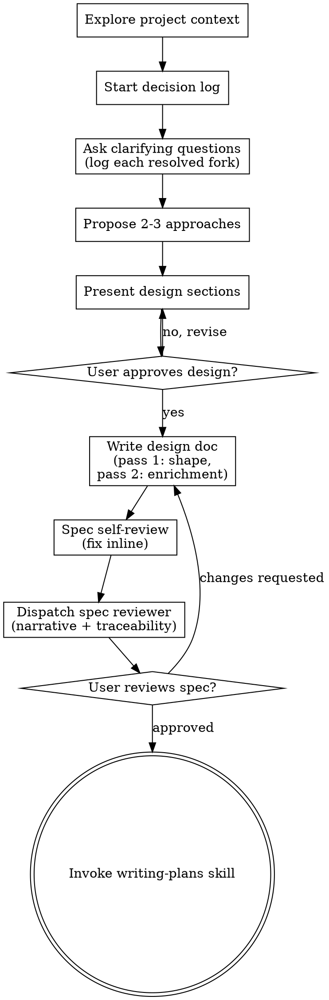

# Brainstorming Ideas Into Designs

Help turn ideas into fully formed designs and specs through natural collaborative dialogue.

Start by understanding the current project context, then ask questions one at a time to refine the idea. Once you understand what you're building, present the design and get user approval.

**Model:** design reasoning is the `very smart` tier and runs in THIS (main) session,
not a subagent — so no `model:` field governs it. It remains native Claude Code work on
`opus`, never a Codex-worker dispatch. The required spec-reviewer dispatch pins the
`very smart` tier in its own prompt template; see subagent-driven-development Model
Selection.

**Launched as a room? (GUARDED — default is standalone, unchanged.)** If — and ONLY if —
your launch brief names an orchestrator address, a reporting protocol (R0–R5), and a
milestone-branch publish recipe, you are an ORCHESTRATED ROOM (an HIL room: the human
converses and rules here, in-session): follow the brief's reporting contract, produce its
FILES-YOU-PRODUCE set, and self-publish via the brief's FF-CAS recipe to the milestone
branch — never to main. See orchestrator/room-mechanics.md. Absent that contract in your
brief, ignore this paragraph entirely — nothing about the standalone flow changes.

<HARD-GATE>
Do NOT invoke any implementation skill, write any code, scaffold any project, or take any implementation action until you have presented a design and the user has approved it. This applies to EVERY project regardless of perceived simplicity.
</HARD-GATE>

## Anti-Pattern: "This Is Too Simple To Need A Design"

Every project goes through this process. A todo list, a single-function utility, a config change — all of them. "Simple" projects are where unexamined assumptions cause the most wasted work. The design can be short (a few sentences for truly simple projects), but you MUST present it and get approval.

## Checklist

You MUST create a task for each of these items and complete them in order:

1. **Explore project context** — check files, docs, recent commits
2. **Start the decision log** — create `docs/superdev/specs/YYYY-MM-DD-<topic>-decisions.md` from `skills/brainstorming/decision-log-template.md`; append every fork AS it is resolved in dialogue (see Decision Logging below)
3. **Offer the visual companion just-in-time** — NOT upfront. The first time a question would genuinely be clearer shown than described, offer it then (its own message); on approval its browser tab opens for you. If no visual question ever arises, never offer it. See the Visual Companion section below.
4. **Ask clarifying questions** — one at a time, understand purpose/constraints/success criteria
5. **Propose 2-3 approaches** — with trade-offs and your recommendation
6. **Present design** — in sections scaled to their complexity, get user approval after each section
7. **Write design doc in two passes** — per `skills/brainstorming/design-doc-template.md`, save to `docs/superdev/specs/YYYY-MM-DD-<topic>-design.md` and commit (see Two-Pass Authoring below)
7b. **Conditional companion artifacts** — work touches domain objects/fields/relationships → the design doc MUST carry a Domain model section per `skills/brainstorming/domain-design-template.md` (the discrepancy hunt: naming table, delta ledger, invariant enforcers). Work adds/renames/reworks CLI commands → write the separate CLI surface doc per `skills/brainstorming/cli-surface-template.md` (families, exhaustive args → Command models, composition rationale, operator sequences with recovery paths). Both are downstream context: they enter the plan's Context pack and subagent Read-first lines.
8. **Spec self-review** — quick inline check for placeholders, contradictions, ambiguity, scope (see below)
9. **Dispatch the spec reviewer subagent** — REQUIRED, per `skills/brainstorming/spec-document-reviewer-prompt.md`; it reads spec + decision log and checks narrative continuity and traceability; fix blocking issues, re-dispatch once
10. **User reviews written spec** — ask user to review the spec file before proceeding
11. **Transition to implementation** — invoke writing-plans skill to create implementation plan

## Process Flow

**The terminal state is invoking writing-plans.** Do NOT invoke frontend-design, mcp-builder, or any other implementation skill. The ONLY skill you invoke after brainstorming is writing-plans.

## The Process

**Understanding the idea:**

- Check out the current project state first (files, docs, recent commits)
- Before asking detailed questions, assess scope: if the request describes multiple independent subsystems (e.g., "build a platform with chat, file storage, billing, and analytics"), flag this immediately. Don't spend questions refining details of a project that needs to be decomposed first.
- If the project is too large for a single spec, help the user decompose into sub-projects: what are the independent pieces, how do they relate, what order should they be built? Then brainstorm the first sub-project through the normal design flow. Each sub-project gets its own spec → plan → implementation cycle.
- For appropriately-scoped projects, ask questions one at a time to refine the idea
- Prefer multiple choice questions when possible, but open-ended is fine too
- Only one question per message - if a topic needs more exploration, break it into multiple questions
- Focus on understanding: purpose, constraints, success criteria

**Exploring approaches:**

- Propose 2-3 different approaches with trade-offs
- Present options conversationally with your recommendation and reasoning
- Lead with your recommended option and explain why

**Presenting the design:**

- Once you believe you understand what you're building, present the design
- Scale each section to its complexity: a few sentences if straightforward, up to 200-300 words if nuanced
- Ask after each section whether it looks right so far
- Cover: architecture, components, data flow, error handling, testing
- Be ready to go back and clarify if something doesn't make sense

**Design for isolation and clarity:**

- Break the system into smaller units that each have one clear purpose, communicate through well-defined interfaces, and can be understood and tested independently
- For each unit, you should be able to answer: what does it do, how do you use it, and what does it depend on?
- Can someone understand what a unit does without reading its internals? Can you change the internals without breaking consumers? If not, the boundaries need work.
- Smaller, well-bounded units are also easier for you to work with - you reason better about code you can hold in context at once, and your edits are more reliable when files are focused. When a file grows large, that's often a signal that it's doing too much.

**Working in existing codebases:**

- Explore the current structure before proposing changes. Follow existing patterns.
- Where existing code has problems that affect the work (e.g., a file that's grown too large, unclear boundaries, tangled responsibilities), include targeted improvements as part of the design - the way a good developer improves code they're working in.
- Don't propose unrelated refactoring. Stay focused on what serves the current goal.

## Decision Logging

The decision log (`docs/superdev/specs/YYYY-MM-DD-<topic>-decisions.md`, from
`skills/brainstorming/decision-log-template.md`) is created BEFORE the first clarifying
question and appended to for the life of the work stream — brainstorm, spec, plan, and
build all write to the same file.

- **Capture at the moment of decision.** When a dialogue fork resolves (the user picks an
  approach, rejects an option, states a constraint that closes a door), append the D#
  entry THEN — trigger, options with gains/sacrifices, why, revisit-when. Do not batch
  and reconstruct at the end; reconstructed reasoning is thinner than live reasoning.
- **Rejected paths are entries too.** "We considered X and declined because Y" is
  precisely what someone needs months later when X gets re-proposed.
- The spec's §5 Decisions section is the distilled subset of this log — same D-numbers,
  shorter entries, with the log holding the full trail.

## After the Design

**Two-Pass Authoring** (per `skills/brainstorming/design-doc-template.md`):

- Write the design doc to `docs/superdev/specs/YYYY-MM-DD-<topic>-design.md`
  - (User preferences for spec location override this default)
- **Pass 1 — the shape + the anchor:** problem & intent (§1), requirements (§2), use
  cases (§3, in the operator's own terms — what they DO and SEE), approach narrative
  (§4), design areas (§5), and acceptance hints (§9, operator-language "what must be
  demonstrable" — NOT pinned commands; receipts are filled later at the gate). §1/§2/§3
  and the §9 hints are the ANCHOR: frozen, bending only by the soften-but-own rule.
  Acceptance lives HERE, not in the plan.
- **Pass 2 — the enrichment:** re-read the dialogue and the decision log, then add
  everything that governs the design without being the design: decisions distilled into
  §6 (with reasoning and revisit-when hooks), assumptions into §7, declined scope into
  §8 — and write the narrative link-sentence that opens every §5 area, citing the R#/D#
  it serves and the UC# it realizes. Pass 2 is NOT optional polish: it is what makes the
  doc consultable when implementation details drift during the build (§10 drift protocol).
- Use elements-of-style:writing-clearly-and-concisely skill if available
- Commit the design document and the decision log to git

**Spec Self-Review:**
After writing the spec document, look at it with fresh eyes:

1. **Placeholder scan:** Any "TBD", "TODO", incomplete sections, or vague requirements? Fix them.
2. **Internal consistency:** Do any sections contradict each other? Does the architecture match the feature descriptions?
3. **Scope check:** Is this focused enough for a single implementation plan, or does it need decomposition?
4. **Ambiguity check:** Could any requirement be interpreted two different ways? If so, pick one and make it explicit.
5. **Trace check:** Does every §5 area cite R#/D# and the UC# it realizes? Does every must-R# and every UC# have a serving area and ≥1 §9 acceptance hint?

Fix any issues inline, then dispatch the spec reviewer subagent
(`skills/brainstorming/spec-document-reviewer-prompt.md`) — it reads the spec AND the
decision log, and is specifically charged with catching narrative gaps (scattered,
unconnected areas) and broken traceability that you, as the author, are least able to
see. Fix blocking issues, re-dispatch once to confirm.

**User Review Gate:**
After the spec review loop passes, ask the user to review the written spec before proceeding:

> "Spec written and committed to `<path>`. Please review it and let me know if you want to make any changes before we start writing out the implementation plan."

Wait for the user's response. If they request changes, make them and re-run the spec review loop. Only proceed once the user approves.

**Implementation:**

- Invoke the writing-plans skill to create a detailed implementation plan
- Do NOT invoke any other skill. writing-plans is the next step.

## Key Principles

- **One question at a time** - Don't overwhelm with multiple questions
- **Multiple choice preferred** - Easier to answer than open-ended when possible
- **YAGNI ruthlessly** - Remove unnecessary features from all designs
- **Explore alternatives** - Always propose 2-3 approaches before settling
- **Incremental validation** - Present design, get approval before moving on
- **Be flexible** - Go back and clarify when something doesn't make sense

## Visual Companion

A browser-based companion for showing mockups, diagrams, and visual options during brainstorming. Available as a tool — not a mode. Accepting the companion means it's available for questions that benefit from visual treatment; it does NOT mean every question goes through the browser.

**Offering the companion (just-in-time):** Do NOT offer it upfront. Wait until a question would genuinely be clearer shown than told — a real mockup / layout / diagram question, not merely a UI *topic*. The first time that happens, offer it then, as its own message:
> "This next part might be easier if I show you — I can put together mockups, diagrams, and comparisons in a browser tab as we go. It's still new and can be token-intensive. Want me to? I'll open it for you."

**This offer MUST be its own message.** Only the offer — no clarifying question, summary, or other content. Wait for the user's response. If they accept, start the server with `--open` so their browser opens to the first screen automatically. If they decline, continue text-only and don't offer again unless they raise it.

**Per-question decision:** Even after the user accepts, decide FOR EACH QUESTION whether to use the browser or the terminal. The test: **would the user understand this better by seeing it than reading it?**

- **Use the browser** for content that IS visual — mockups, wireframes, layout comparisons, architecture diagrams, side-by-side visual designs
- **Use the terminal** for content that is text — requirements questions, conceptual choices, tradeoff lists, A/B/C/D text options, scope decisions

A question about a UI topic is not automatically a visual question. "What does personality mean in this context?" is a conceptual question — use the terminal. "Which wizard layout works better?" is a visual question — use the browser.

If they agree to the companion, read the detailed guide before proceeding:
`skills/brainstorming/visual-companion.md`
