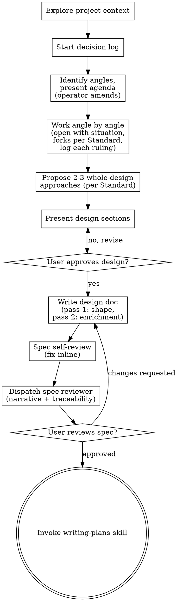

# Brainstorming Ideas Into Designs

Help turn ideas into fully formed designs and specs through natural collaborative dialogue.

Start by understanding the current project context, then ask questions one at a time to refine the idea. Once you understand what you're building, present the design and get user approval.

**Model:** design reasoning is the `very smart` tier and runs in THIS (main) session,
not a subagent — so no `model:` field governs it. It remains native Claude Code work on
`opus`, never a Codex-worker dispatch. The required spec-reviewer dispatch pins the
`very smart` tier in its own prompt template; see subagent-driven-development Model
Selection.

**Launched as a room? (GUARDED — default is standalone, unchanged.)** If — and ONLY if —
your launch brief names an orchestrator address, a reporting protocol (R0–R5), and a
milestone-branch publish recipe, you are an ORCHESTRATED ROOM (an HIL room: the human
converses and rules here, in-session): follow the brief's reporting contract, produce its
FILES-YOU-PRODUCE set, and self-publish via the brief's FF-CAS recipe to the milestone
branch — never to main. See orchestrator/room-mechanics.md. Absent that contract in your
brief, ignore this paragraph entirely — nothing about the standalone flow changes.

<HARD-GATE>
Do NOT invoke any implementation skill, write any code, scaffold any project, or take any implementation action until you have presented a design and the user has approved it. This applies to EVERY project regardless of perceived simplicity.
</HARD-GATE>

## Anti-Pattern: "This Is Too Simple To Need A Design"

Every project goes through this process. A todo list, a single-function utility, a config change — all of them. "Simple" projects are where unexamined assumptions cause the most wasted work. The design can be short (a few sentences for truly simple projects), but you MUST present it and get approval.

## Checklist

You MUST create a task for each of these items and complete them in order:

1. **Ground and write the census** — explore files, docs, recent commits, and COMMIT the
   findings as `docs/superdev/specs/YYYY-MM-DD-<topic>-census.md` before presenting the
   agenda. Every claim carries its provenance tier: **MEASURED** (output of a command run
   this session, command quoted) · **READ** (from source or a committed doc, file:line
   given) · **FLAGGED** (noticed, unverified — "the work queue, not conclusions"; a
   FLAGGED line is never silently promoted to evidence). Small sessions write a five-line
   census; the artifact scales in length, never in kind. **If a `docs/system-design/` corpus exists** (see superdev:system-design; its glossary is the shared vocabulary): this brainstorm is ITEM-level — read the map rows and angle passages governing this item and QUOTE the load-bearing ones into the session **with file:line**; ground on the area's post-migration vision document (`YYYY-MM-DD-<area>-post-migration-domain.md`, not the legacy code) wherever the map's verdict is RESHAPE/REPLACE. System-scale design (many items, cross-boundary) is NOT this skill — hand it to superdev:system-design. A cross-boundary concern discovered here is recorded in YOUR OWN item files and reported to the orchestrator with a pointer (D51/D61) — never a local ruling, never a write into anyone else's space
2. **Start the decision log** — create `docs/superdev/specs/YYYY-MM-DD-<topic>-decisions.md` from `skills/brainstorming/decision-log-template.md`; append every fork AS it is resolved in dialogue (see Decision Logging below)
3. **Offer the visual companion just-in-time** — NOT upfront. The first time a question would genuinely be clearer shown than described, offer it then (its own message); on approval its browser tab opens for you. If no visual question ever arises, never offer it. See the Visual Companion section below.
4. **Identify angles and PRESENT the angle plan** — before the first clarifying question: what kind of problem is this, which 3–5 candidate ANGLES govern it (superdev:system-design `angle-guide.md#item-angles`: one central question · boundaries · concrete consequences · visible collisions · reconciled outcome), what is probably unexamined. Then PRESENT the angle list to the operator as the session agenda — each angle named with its central question and one line on why it matters — and let the operator amend it (drop, add, reorder) before work starts. The agreed agenda is the session's spine; emergent angles discovered mid-session are ADDED to it explicitly ("this collision opens a new angle — adding it"), never worked silently. The agreed agenda — and every mid-session amendment to it — is recorded in the decision log (it is the session's spine; a future reader needs it)
5. **Work angle by angle** — clarifying questions one at a time (purpose/constraints/success criteria first), then the agenda's angles in order. OPEN each angle with its situation in prose — what is being decided, what breaks or diverges depending on the answer — before any option appears; a bare option list with no situation gives the operator nothing to rule on. Forks inside an angle follow the Fork Presentation Standard below; the full movement protocol (frame → explore → collide → log → follow consequences → close; its 7th step, write-at-checkpoint, is system-scale only) is superdev:system-design `angle-guide.md#angle-movement`. Close each angle by stating what was reconciled — and if the angle carried real
collisions, WRITE its companion NOW, to `item-angle-template.md`'s teaching form
(mental model, journey with `### LOCKED — claim` + "this means…", cannot-do, mismatch,
collisions the journey didn't settle), and commit it before the next angle opens. The
collision detail is hot exactly now; batching to session end produces cite-only
indexes (measured: ~380 words vs the ~1,500+ the same angles carried when written hot). Overlap with system angles is expected — system angles skip details deliberately; this session is where details live
6. **Propose 2-3 whole-design approaches** — AFTER the angles are reconciled: how the rulings compose into a shape. This is a fork like any other — present it per the Fork Presentation Standard, never as bare labels
7. **Present design** — in sections scaled to their complexity, get user approval after each section
7b. **Test disposition (REQUIRED when the item touches existing tests/legacy code):** per touched area, put the question to the operator: {keep · regenerate · archive-then-rewrite · fix-in-place}. The answer is recorded in the spec's Operational notes and BINDS the plan (which may refine mechanics, never reverse — D28). For archive-then-rewrite, name what the harvest must capture.
8. **Write design doc in two passes** — per `skills/brainstorming/design-doc-template.md`, save to `docs/superdev/specs/YYYY-MM-DD-<topic>-design.md` and commit (see Two-Pass Authoring below). **Item angle companions:** already written at each angle's close (step 5); this step only confirms the set is complete and named `docs/superdev/specs/YYYY-MM-DD-<topic>-angle-NN-<slug>.md` — beside the spec, never in the system corpus. **Vision demand:** if the design implies variants or a post-migration shape, a vision document is produced or demanded before the affected areas can be marked LOCKED
8b. **Conditional companion artifacts** — work touches domain objects/fields/relationships → the design doc MUST carry a Domain model section per `skills/brainstorming/domain-design-template.md` (the discrepancy hunt: naming table, delta ledger, invariant enforcers). Work adds/renames/reworks CLI commands → write the separate CLI surface doc per `skills/brainstorming/cli-surface-template.md` (families, exhaustive args → Command models, composition rationale, operator sequences with recovery paths). Both are downstream context: they enter the plan's Context pack and subagent Read-first lines.
8c. **The in-session reconcile sweep** — the session's last writing act: re-check EVERY
   produced document (census, companions, spec) against EVERY D# ruled this session; flip
   statuses that moved, banner anything superseded, fix any recommendation still reading
   as pending after its fork resolved. One commit. A document set shipped without the
   sweep contains its own contradictions.
9. **Spec self-review** — quick inline check for placeholders, contradictions, ambiguity, scope (see below)
10. **Dispatch the spec reviewer subagent** — REQUIRED, per `skills/brainstorming/spec-document-reviewer-prompt.md`; it reads spec + decision log + census + EVERY angle companion, checks narrative continuity and traceability, and runs the angle experience probes (stranger test, LOCKED-without-consequence, bare "later"); fix blocking issues, re-dispatch once
11. **User reviews the written set** — hand the operator EVERYTHING by file link: the spec, the decision log, the census, and every angle companion. The operator reviews documents, not a chat summary — approval means the written record is what got approved
12. **Transition to implementation** — invoke writing-plans skill to create implementation plan

## Presentation convention (all session output)

- Plain explanation first; models or short flows only where they improve understanding.
- Small typed sketches for domain shapes; explicit use cases for behavior; tables for
  ownership, comparisons, and repeated mappings.
- Visuals are optional and never bare — a diagram always rides an understandable text
  explanation.
- Label claims with the marker statuses; label invented quantities SEED-ILLUSTRATIVE and
  cite measured ones with their source — the two must never be typographically identical.
- Once a fork is resolved, the written record shows the SELECTED design and why. It never
  preserves a recommendation as though the choice were still pending.
- Register law: these rules govern DELIVERABLES (documents). Conversation stays terse —
  and never the other way around.

## Fork Presentation Standard (what the operator rules on) {#fork-presentation-standard}

An option the operator cannot evaluate is not an option. Every fork presented for a
ruling carries:

1. **The situation** — what is being decided, and what breaks or diverges depending on
   the answer: the failure modes, not just the topic.
2. **Each option's mechanism** — how it actually works, not its label; include a worked
   or concrete example whenever the option is abstract (a sample file line, a command, a
   quoted sentence — something the operator can picture in THIS project).
3. **Each option's consequences** — what it costs and what it buys, stated for this
   project, not generically.
4. **A recommendation with its reasoning** — evidence over taste where evidence exists.

A/B labels are for REFERRING to options, never a substitute for presenting them.
A fork awaiting a ruling is presented IN FULL at every asking — "as presented
earlier" is never a substitute; the operator rules on what is in front of them
now, not on scrollback.

**Variants with shape arrive as sketches.** Where an option has structure — a type, a
file layout, a message format, a command — the option IS the sketch: the thing itself,
small and concrete, not prose about it. The operator's pattern-matching is the instrument
doing the ruling; give it material.

**The pick is an event.** Record the selection itself in the D# entry: who picked, which
variant, and any RIDER the operator attached ("selected C with an explicit extensibility
requirement"). A rider is the operator amending the offered menu; it enters the law with
the same force as the variant. Options are never take-it-or-leave-it.
Compression is for the trivial end only: if a fork honestly fits in three lines, it is
probably not worth the operator's attention — decide it yourself, state the call in one
sentence, and log it (the decision log records it either way). Spend the operator's
attention on forks presented in full, not on many forks presented thinly.

## Process Flow

```dot
digraph brainstorming {
    "Explore project context" [shape=box];
    "Start decision log" [shape=box];
    "Identify angles,\npresent agenda\n(operator amends)" [shape=box];
    "Work angle by angle\n(open with situation,\nforks per Standard,\nlog each ruling)" [shape=box];
    "Propose 2-3 whole-design\napproaches (per Standard)" [shape=box];
    "Present design sections" [shape=box];
    "User approves design?" [shape=diamond];
    "Write design doc\n(pass 1: shape,\npass 2: enrichment)" [shape=box];
    "Spec self-review\n(fix inline)" [shape=box];
    "Dispatch spec reviewer\n(narrative + traceability)" [shape=box];
    "User reviews spec?" [shape=diamond];
    "Invoke writing-plans skill" [shape=doublecircle];

    "Explore project context" -> "Start decision log";
    "Start decision log" -> "Identify angles,\npresent agenda\n(operator amends)";
    "Identify angles,\npresent agenda\n(operator amends)" -> "Work angle by angle\n(open with situation,\nforks per Standard,\nlog each ruling)";
    "Work angle by angle\n(open with situation,\nforks per Standard,\nlog each ruling)" -> "Propose 2-3 whole-design\napproaches (per Standard)";
    "Propose 2-3 whole-design\napproaches (per Standard)" -> "Present design sections";
    "Present design sections" -> "User approves design?";
    "User approves design?" -> "Present design sections" [label="no, revise"];
    "User approves design?" -> "Write design doc\n(pass 1: shape,\npass 2: enrichment)" [label="yes"];
    "Write design doc\n(pass 1: shape,\npass 2: enrichment)" -> "Spec self-review\n(fix inline)";
    "Spec self-review\n(fix inline)" -> "Dispatch spec reviewer\n(narrative + traceability)";
    "Dispatch spec reviewer\n(narrative + traceability)" -> "User reviews spec?";
    "User reviews spec?" -> "Write design doc\n(pass 1: shape,\npass 2: enrichment)" [label="changes requested"];
    "User reviews spec?" -> "Invoke writing-plans skill" [label="approved"];
}
```

**The terminal state is invoking writing-plans.** Do NOT invoke frontend-design, mcp-builder, or any other implementation skill. The ONLY skill you invoke after brainstorming is writing-plans.

## The Process

**Understanding the idea:**

- Check out the current project state first (files, docs, recent commits)
- Before asking detailed questions, assess scope: if the request describes multiple independent subsystems (e.g., "build a platform with chat, file storage, billing, and analytics"), flag this immediately. Don't spend questions refining details of a project that needs to be decomposed first.
- If the project is too large for a single spec, help the user decompose into sub-projects: what are the independent pieces, how do they relate, what order should they be built? Then brainstorm the first sub-project through the normal design flow. Each sub-project gets its own spec → plan → implementation cycle.
- For appropriately-scoped projects, ask questions one at a time to refine the idea
- Multiple choice is fine for REFERRING to options — but every fork reaching the operator is presented per the Fork Presentation Standard (situation, mechanism with example, consequences, recommendation), never as bare labels
- Only one question per message - if a topic needs more exploration, break it into multiple questions
- Focus on understanding: purpose, constraints, success criteria

**Exploring approaches:**

- Propose 2-3 materially different approaches, each presented per the Fork Presentation
  Standard: the situation and its failure modes, each option's mechanism with a concrete
  example, its consequences for THIS project, and your recommendation with reasoning
- Lead with your recommended option and explain why

**Presenting the design:**

- Once you believe you understand what you're building, present the design
- Scale each section to its complexity: a few sentences if straightforward, up to 200-300 words if nuanced
- Ask after each section whether it looks right so far
- Cover: architecture, components, data flow, error handling, testing
- Be ready to go back and clarify if something doesn't make sense

**Design for isolation and clarity:**

- Break the system into smaller units that each have one clear purpose, communicate through well-defined interfaces, and can be understood and tested independently
- For each unit, you should be able to answer: what does it do, how do you use it, and what does it depend on?
- Can someone understand what a unit does without reading its internals? Can you change the internals without breaking consumers? If not, the boundaries need work.
- Smaller, well-bounded units are also easier for you to work with - you reason better about code you can hold in context at once, and your edits are more reliable when files are focused. When a file grows large, that's often a signal that it's doing too much.

**Working in existing codebases:**

- Explore the current structure before proposing changes. Follow existing patterns.
- Where existing code has problems that affect the work (e.g., a file that's grown too large, unclear boundaries, tangled responsibilities), include targeted improvements as part of the design - the way a good developer improves code they're working in.
- Don't propose unrelated refactoring. Stay focused on what serves the current goal.

## Decision Logging

The decision log (`docs/superdev/specs/YYYY-MM-DD-<topic>-decisions.md`, from
`skills/brainstorming/decision-log-template.md`) is created BEFORE the first clarifying
question and appended to for the life of the work stream — brainstorm, spec, plan, and
build all write to the same file.

- **Capture at the moment of decision.** When a dialogue fork resolves (the user picks an
  approach, rejects an option, states a constraint that closes a door), append the D#
  entry THEN — trigger, options with gains/sacrifices, why, revisit-when. Do not batch
  and reconstruct at the end; reconstructed reasoning is thinner than live reasoning.
- **Rejected paths are entries too.** "We considered X and declined because Y" is
  precisely what someone needs months later when X gets re-proposed.
- The spec's §5 Decisions section is the distilled subset of this log — same D-numbers,
  shorter entries, with the log holding the full trail.

## After the Design

**Two-Pass Authoring** (per `skills/brainstorming/design-doc-template.md`):

- Write the design doc to `docs/superdev/specs/YYYY-MM-DD-<topic>-design.md`
  - (User preferences for spec location override this default)
- **Pass 1 — the shape + the anchor:** problem & intent (§1), requirements (§2), use
  cases (§3, in the operator's own terms — what they DO and SEE), approach narrative
  (§4), design areas (§5), and acceptance hints (§9, operator-language "what must be
  demonstrable" — NOT pinned commands; receipts are filled later at the gate). §1/§2/§3
  and the §9 hints are the ANCHOR: frozen, bending only by the soften-but-own rule.
  Acceptance lives HERE, not in the plan.
- **Pass 2 — the enrichment:** re-read the dialogue and the decision log, then add
  everything that governs the design without being the design: decisions distilled into
  §6 (with reasoning and revisit-when hooks), assumptions into §7, declined scope into
  §8 — and write the narrative link-sentence that opens every §5 area, citing the R#/D#
  it serves and the UC# it realizes. Pass 2 is NOT optional polish: it is what makes the
  doc consultable when implementation details drift during the build (§10 drift protocol).
- Use elements-of-style:writing-clearly-and-concisely skill if available
- Commit the design document and the decision log to git

**Spec Self-Review:**
After writing the spec document, look at it with fresh eyes:

1. **Placeholder scan:** Any "TBD", "TODO", incomplete sections, or vague requirements? Fix them.
2. **Internal consistency:** Do any sections contradict each other? Does the architecture match the feature descriptions?
3. **Scope check:** Is this focused enough for a single implementation plan, or does it need decomposition?
4. **Ambiguity check:** Could any requirement be interpreted two different ways? If so, pick one and make it explicit.
5. **Trace check:** Does every §5 area cite R#/D# and the UC# it realizes? Does every must-R# and every UC# have a serving area and ≥1 §9 acceptance hint?

Fix any issues inline, then dispatch the spec reviewer subagent
(`skills/brainstorming/spec-document-reviewer-prompt.md`) — it reads the spec AND the
decision log, and is specifically charged with catching narrative gaps (scattered,
unconnected areas) and broken traceability that you, as the author, are least able to
see. Fix blocking issues, re-dispatch once to confirm.

**User Review Gate:**
After the spec review loop passes, ask the user to review the written spec before proceeding:

> "The set is written and committed — spec: `<link>` · decision log: `<link>` · census: `<link>` · angles: `<links>`. Please review before we write the implementation plan."

Wait for the user's response. If they request changes, make them and re-run the spec review loop. Only proceed once the user approves.

**Implementation:**

- Invoke the writing-plans skill to create a detailed implementation plan
- Do NOT invoke any other skill. writing-plans is the next step.

## Key Principles

- **One question at a time** - Don't overwhelm with multiple questions
- **Angle agenda first** - Present the angle plan; the operator amends it before work starts
- **Present forks in full** - Fork Presentation Standard always: situation, mechanism with example, consequences, recommendation. Labels refer; they never present. Trivial forks: decide yourself and log
- **YAGNI ruthlessly** - Remove unnecessary features from all designs
- **Explore alternatives** - Always propose 2-3 approaches before settling
- **Incremental validation** - Present design, get approval before moving on
- **Be flexible** - Go back and clarify when something doesn't make sense

## Visual Companion

A browser-based companion for showing mockups, diagrams, and visual options during brainstorming. Available as a tool — not a mode. Accepting the companion means it's available for questions that benefit from visual treatment; it does NOT mean every question goes through the browser.

**Offering the companion (just-in-time):** Do NOT offer it upfront. Wait until a question would genuinely be clearer shown than told — a real mockup / layout / diagram question, not merely a UI *topic*. The first time that happens, offer it then, as its own message:
> "This next part might be easier if I show you — I can put together mockups, diagrams, and comparisons in a browser tab as we go. It's still new and can be token-intensive. Want me to? I'll open it for you."

**This offer MUST be its own message.** Only the offer — no clarifying question, summary, or other content. Wait for the user's response. If they accept, start the server with `--open` so their browser opens to the first screen automatically. If they decline, continue text-only and don't offer again unless they raise it.

**Per-question decision:** Even after the user accepts, decide FOR EACH QUESTION whether to use the browser or the terminal. The test: **would the user understand this better by seeing it than reading it?**

- **Use the browser** for content that IS visual — mockups, wireframes, layout comparisons, architecture diagrams, side-by-side visual designs
- **Use the terminal** for content that is text — requirements questions, conceptual choices, tradeoff lists, A/B/C/D text options, scope decisions

A question about a UI topic is not automatically a visual question. "What does personality mean in this context?" is a conceptual question — use the terminal. "Which wizard layout works better?" is a visual question — use the browser.

If they agree to the companion, read the detailed guide before proceeding:
`skills/brainstorming/visual-companion.md`
